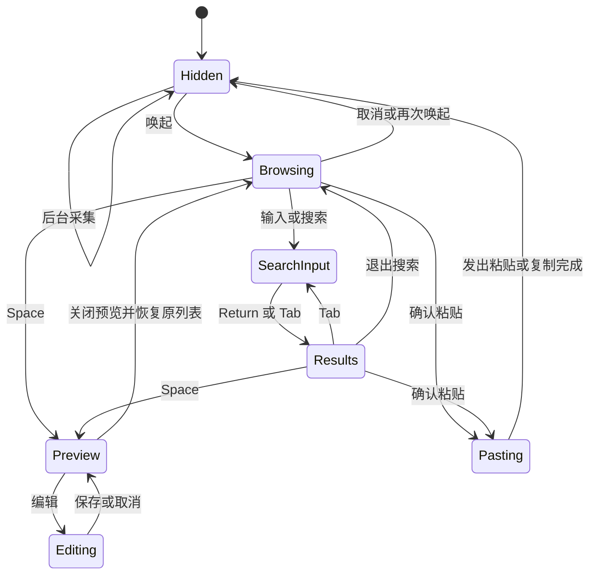

# ClipShelf 产品动线与体验验收

状态：Draft v0.1 评审草案 · 基准核对日期：2026-10-09 · 目标平台：macOS。

ClipShelf 的目标是完整复现 Paste 在 Mac 上的功能与核心交互体验，并免费开源。最重要的用户结果是：在原来的 App 中唤起剪贴板面板，找到内容，粘贴回原窗口的输入位置，然后立即继续工作。功能分阶段实现，但高级功能仍属于完整目标。

本稿定义用户可见的入口、动作、状态、异常恢复和验收场景；系统模块、数据协议和性能测试方法见 [技术规格](TECHNICAL_SPEC.zh-CN.md)。所有实现状态均为待开发，文中的验收案例不代表已经通过测试。

阅读导航：[首启](#u01) · [核心唤起与粘贴](#u03) · [搜索与键盘](#u04) · [Stack](#u09) · [隐私](#u10) · [同步共享](#u12) · [智能建议](#intelligence) · [MCP](#mcp) · [验收案例](#acceptance)

## 1 范围与判定方式

“完整”以指定版本的 Paste for Mac 为比较对象，包含采集、检索、组织、粘贴、系统整合、同步、共享、智能建议和 MCP。iPhone 与 iPad 的独立应用、键盘扩展和分屏体验作为 F20 生态范围待确认；不能把仅完成 Mac 版称为复现了整个 Apple 生态。

本稿使用三种标记区分事实与决策：**Paste 基准**表示官网明确描述的能力；**ClipShelf 方案**表示本项目的体验契约；**待基准观测**表示需要使用真实 Paste 记录的行为。未标记为 Paste 基准的验收要求均是 ClipShelf 方案。窗口尺寸、动画曲线、轮询间隔和焦点恢复时序均不臆测为 Paste 的已知参数。

复现使用场景、信息层级和操作结果，独立实现代码与视觉资源；应用名称、图标和帮助文字使用 ClipShelf 自身标识。免费完整安装包与源代码是产品承诺，付费实战材料不改变软件功能范围。

| 阶段 | 交付重点 | 可作出的完成声明 |
| --- | --- | --- |
| M0 | 真实 Paste 基准观察与系统能力验证 | 已形成可重复比较的体验基线 |
| M1 | 采集、面板、搜索、正确粘贴 | 核心操作链可用，尚未完成全量复现 |
| M2 | 完整本地高级工作流 | 本地功能范围完成，整合功能继续推进 |
| M3 | 同步、共享、智能能力、MCP | 功能面齐备，等待完整兼容性验收 |
| M4 | 全量兼容、性能、安装更新与发布验收 | 对明确版本和支持范围完成对标 |

## 2 功能范围与日常入口

| ID | 能力 | 主要入口 | 主要阶段 |
| --- | --- | --- | --- |
| F01 | 文本、富文本、链接、图片、文件、颜色等采集 | 原 App 的复制操作 | M1，格式扩展 M2 |
| F02 | 底部面板、显示器定位、焦点生命周期 | 全局快捷键、菜单栏 | M1 |
| F03 | 全局搜索与组合筛选 | 直接输入、搜索按钮 | M1，完整筛选 M2 |
| F04 | 直接粘贴、复制降级与故障恢复 | Return、双击、菜单 | M1 |
| F05 | 键盘导航、Quick Paste、纯文本模式 | 面板键盘操作 | M1–M2 |
| F06 | 多选、拖入拖出、图片与文件输出 | 卡片、文件拖放 | M2 |
| F07 | Quick Look、链接预览与打开原内容 | Space、预览、打开 | M2 |
| F08 | 新建、编辑、重命名、颜色与图片处理 | 卡片菜单、编辑预览 | M2 |
| F09 | Pinboards 创建、移动、排序与管理 | 板标签、卡片菜单 | M2 |
| F10 | Paste Stack 顺序复制粘贴 | 专用快捷键、Stack 面板 | M2 |
| F11 | 暂停、应用排除、敏感与临时过滤、屏幕共享时隐藏 | 菜单栏、隐私设置 | M1–M2 |
| F12 | 保留期限、容量、清理、备份恢复 | 通用与数据设置 | M2 |
| F13 | 首启、权限、快捷键、登录启动、更新 | 引导、设置、菜单栏 | M1–M4 |
| F14 | OCR、图片文字搜索与提取 | 搜索、图片预览 | M2 |
| F15 | 系统分享、Shortcuts、连续互通扫描 | 系统入口与菜单 | M3 |
| F16 | 多 Mac 同步 | 同步设置、同步状态 | M3 |
| F17 | Shared Pinboards | 板的共享菜单 | M3 |
| F18 | Intelligent Clipboard 与 Writing Tools | 建议按钮、编辑器 | M3 |
| F19 | MCP 与 AI 工具连接 | 智能设置、接入向导 | M3 |
| F20 | iPhone 与 iPad 生态 | 移动应用、键盘、分享扩展 | 范围待确认 |

## 3 用户工作表面

| 表面 | 解决的问题 | 保持的上下文 |
| --- | --- | --- |
| 菜单栏 | 唤起、暂停、状态、设置、退出 | 当前工作的 App |
| 底部主面板 | 快速找回与粘贴内容 | 目标 App、所在屏幕、当前选择 |
| 历史与板标签 | 在最近记录与常用内容之间切换 | 各列表滚动位置与选择 |
| 搜索栏和筛选条 | 缩小检索范围 | 查询、筛选、结果焦点 |
| 卡片和上下文菜单 | 辨识内容并执行操作 | 选中项与多选集合 |
| Quick Look 和编辑预览 | 看清、修改、提取内容 | 返回时仍定位同一条记录 |
| Stack 浮层 | 按顺序跨 App 填入一组内容 | 当前队首、方向、剩余数量 |
| 设置窗口 | 修改稳定偏好和数据策略 | 主面板状态独立保存 |
| 同步与共享状态 | 理解待同步、权限和协作变化 | 本地可用内容持续可访问 |

Paste 基准是底部横向时间线，可调整高度并进入 Compact Mode；在用户正在工作的显示器上出现。ClipShelf 对同一场景应提供相同层级的入口，具体边距、密度和活跃显示器判定在 M0 记录。[Paste on Mac](https://pasteapp.io/help/paste-on-mac)

主面板从上到下包含列表入口和搜索、卡片内容、必要的状态提示。来源应用、内容类型、复制时间用于辨识卡片；错误只出现在相关条目或状态区域。历史记录为空、搜索无结果、暂停和权限缺失具有不同文案，不能都显示“没有内容”。

## 4 核心操作链与状态

图中箭头表达用户可感知的先后关系；底层准备数据、写剪贴板与恢复焦点的精确时序由技术规格约束。目标内容插入结果要在实机验收中检查，应用不能仅因发出快捷键就声称内容已经进入目标文档。

预览返回必须恢复进入前的搜索或普通列表，图中 Browsing 为列表态统称。采集状态另分“记录中、暂停、故障”，同步状态另分“关闭、同步中、已同步、离线、需处理”；这些状态不阻止读取本地历史。

## 5 首次启动与权限 F13

1. 用户从安装包打开应用，看到用途、后台记录行为和本地保存说明；不要求注册即可开始本地使用。
2. 用户选择或确认唤起快捷键，界面即时检查冲突并提供试用按钮；记录的默认参考是 `⌘⇧V`。
3. 用户确认保留期限与隐私选项，再开始记录；引导使用示例内容演示面板，不把示例混入真实历史。
4. 辅助功能权限采用解释用途、打开系统设置、返回后重新检测的完整路径；用户可跳过并使用复制模式。
5. 通过一次“复制示例 → 唤起 → 选择 → 回到示例输入框”的练习确认完成；失败显示准确的下一步。
6. 登录时启动为独立开关；选择稍后设置不会妨碍完成引导。同步、屏幕访问和 MCP 在用户进入对应功能时再开启。

Paste 基准的直接粘贴依赖辅助功能权限，缺少权限时 Return 和双击改为复制到剪贴板，Stack 不可用。ClipShelf 按同样能力边界提示，系统设置入口随实际系统版本适配。[直接粘贴权限](https://pasteapp.io/help/paste-directly-to-other-applications)

权限被撤销或更新后失效时，不循环弹窗。下一次直接粘贴提供“内容已复制，按 ⌘V 粘贴”和“检查权限”入口；用户修复后原有历史、快捷键和面板偏好应保持。

## 6 后台采集与识别 F01

用户继续使用原 App 的复制操作，历史自动增加卡片，无需切换到 ClipShelf。Paste 官方列明 Mac 可采集文本、链接、图片、文件和颜色；原格式默认保留。[采集范围](https://pasteapp.io/help/what-paste-captures)

| 输入场景 | ClipShelf 输出与动作 | 异常路径 |
| --- | --- | --- |
| 复制普通文本、中文或代码 | 保留原内容、换行与缩进，卡片显示可辨识片段 | 不因自动识别而改写正文 |
| 复制网页富文本 | 保存可还原的格式，同时提供纯文本输出 | 目标只支持纯文本时遵从目标能力 |
| 复制 URL | 显示链接与标题，保持原 URL 可复制 | 未取得标题仍显示 URL |
| 复制图片或截图 | 显示缩略图与尺寸，原图在使用时可取 | 解码失败保留错误状态与删除入口 |
| 复制一个或多个文件 | 显示文件名、类型和数量 | 源文件不可用时提供定位或重新选择 |
| 复制颜色代码 | 显示色块、代码和可编辑信息 | 普通数字不误识别为颜色 |
| 快速连续复制 | 按实际捕获顺序记录，列表不跳动打断当前选择 | 不能捕获的变化不得以“全部记录”掩盖 |
| 同内容再次复制 | 按技术规格的去重策略更新最近位置 | 正在浏览时不偷换当前选中内容 |

颜色兼容基准采用单独六位十六进制代码：含 `#` 或至少一个 A–F 字母；`#FFF`、`rgb()`、纯六位数字和夹在句中的代码先按文本处理。更宽识别属于后续明确列出的差异。[颜色识别规则](https://pasteapp.io/help/what-paste-captures)

ClipShelf 自己把条目写回剪贴板时不无限新增历史。大内容处理期间先显示处理中状态，转换失败不阻塞后续复制；具体容量和延迟预算见技术规格，不在产品稿中当作 Paste 实测值。

## 7 唤起与返回原 App F02 F04

用户位于文档、代码编辑器或聊天输入框时，按快捷键打开面板，原窗口保持可见。选择条目后，面板收起，内容进入原目标，再输入的字符继续落在该处；取消面板也应返回原工作位置。

| 分支 | 预期行为 |
| --- | --- |
| 连续按唤起快捷键 | 在显示与隐藏之间切换，不创建多个面板 |
| 用户正在另一个显示器工作 | 面板在对应显示器出现；拔掉屏幕后仍可找回 |
| 全屏 App、不同 Space、Stage Manager | 用户不被无故带到别的桌面；逐场景列支持结果 |
| 同 App 有多个窗口 | 粘贴回唤起时的目标窗口，而非任意同名窗口 |
| 面板打开后主动切换目标 | 不沿用过时目标偷偷粘贴；重新确认本次目标或降级复制 |
| 目标窗口关闭、App 退出 | 保留已复制内容，提示手动选择目标，不向别处发送粘贴 |
| 目标没有可粘贴区域 | 不显示虚假的成功；用户可手动粘贴或换目标 |
| 快速重复按 Return | 一次动作只触发一次粘贴，防止重复插入 |
| 目标是终端或聊天输入框 | 只执行粘贴，不自动附加提交键 |

焦点丢失、目标变更判定和面板外点击关闭规则列为 M0 必测。ClipShelf 不提供“任何 App 都百分之百成功”的空泛承诺；支持矩阵说明正常、降级和未验证场景。

## 8 搜索与筛选 F03

Paste 基准：直接输入开始全局搜索，结果包含历史与板内条目；可按内容类型、来源 App、设备和日期筛选。搜索框 Return 先转到结果，第二次 Return 才粘贴，Tab 往返切换焦点。[搜索和筛选](https://pasteapp.io/help/search-and-filters)

1. 唤起后输入关键词，查询和筛选始终可见，结果随输入更新；中文拼音候选期间按输入法规则处理。
2. 选择筛选建议后生成独立条件，可修改或移除，条件不能悄悄留在不可见状态；支持一个或多个 Pinboards 的组合筛选，当前版本入口在 M0 校准。[2026 年 3 月筛选更新](https://pasteapp.io/updates)
3. 输入完成按 Return，焦点移入结果并保持查询；左右选择、Space 预览、再次 Return 粘贴。
4. 回到搜索框可继续修改；清除关键词与清除全部条件有明确区别，零结果提供“清除筛选”。
5. 结果卡片能跳到所在历史或板；Paste 现行 `⌘G` 在单选时执行此动作。[结果定位](https://pasteapp.io/help/search-and-filters)

ClipShelf 方案：搜索覆盖标题、正文、来源信息和 OCR 可用文字；OCR 尚未完成时不显示“已搜索所有图片”。同一条目出现在历史与板中不重复堆叠，卡片显示所在位置，具体去重展示需对照实机。

## 9 键盘 输入法 鼠标与触控板 F05

| 上下文 | 操作 | 目标动作 |
| --- | --- | --- |
| 普通列表 | 左右方向键；`⌘↑` / `⌘↓` | 相邻条目；首项或末项 |
| 普通列表 | `⇧←` / `⇧→`；`⌘A` | 扩展选择；选择当前结果集 |
| 已选条目 | Return；`⇧Return` | 原格式粘贴；纯文本粘贴 |
| 面板当前列表 | `⌘1`–`⌘9` | Quick Paste 对应编号条目 |
| 面板当前列表 | `⇧⌘1`–`⇧⌘9` | Quick Paste 纯文本输出 |
| 搜索框 | Return；Tab；再次 `⌘F` | 进入结果；切换焦点；全部筛选 |
| 条目 | Space；`⌘E`；`⌘R`；`⌘O` | 预览；编辑；重命名；打开链接或文件 |
| 列表 | `⌘C`；Delete；`⌘Z` | 复制选择；删除；撤销支持的本地动作 |
| 主面板 | `⌘N`；`⇧⌘N`；`⌘,` | 新建文本；新建板；设置 |
| 列表切换 | `⌘←` / `⌘→` | 上一个板或下一个板 |

以上默认映射依据 Paste 官方快捷键表；可配置的激活、Stack、板切换和单个修饰键与固定应用内快捷键要分开显示。[键盘快捷键](https://pasteapp.io/help/keyboard-shortcuts)

Quick Paste 使用当前列表的编号，先唤起再按数字；不能误实现为后台全局数字热键，也不能假定某个编号永远绑定某条内容。按住修饰键显示编号，选择对象在按键动作期间保持稳定。[Quick Paste](https://pasteapp.io/help/quick-paste-with-numbered-shortcuts)

输入法存在未提交文本时，Return 确认候选、Space 翻候选、Esc 取消组合；均不得触发粘贴、预览或隐藏面板。编辑框的方向键、删除、全选和撤销优先处理文本。只有焦点处在列表时才解释为条目命令。

Esc 按编辑草稿、预览、筛选弹层、搜索、面板逐层退出，具体层级依真实 Paste 观察校准；带未保存内容的关闭要给保留或放弃路径。鼠标单击选择、双击粘贴，滚轮和触控板可浏览横向时间线；菜单动作与键盘动作共享相同结果。

## 10 多选 拖放与纯文本 F05 F06

多选用 `⌘` 增减条目、`⇧` 选择区间，卡片显示明确选中态与数量。多项粘贴先决定稳定顺序，再按内容类型输出；文本分隔符、混合格式的合并方式、图片数量及文件表现列入 M0，不能由开发者临时猜测。

拖出时，在目标接受内容后结束操作；拖回面板或按 Esc 取消时，记录不丢失。拖入支持文本、链接、图片和文件，目标板具有明确高亮；用户能区分“加入历史”“加入板”和“板内排序”。拖放失败后选中内容仍在。

纯文本可按次使用或设置为始终使用。Paste 官方说明 `⇧Return` 应在其面板中操作；设置不会自动重写系统当前剪贴板。ClipShelf 同样保留历史原格式，纯文本模式只改变本次输出。[纯文本模式](https://pasteapp.io/help/paste-as-plain-text)

有文字表示的条目可转换，只有图片或文件时不伪造文字；OCR 提取为独立动作。文件路径文本与文件对象在菜单中区分，避免用户以为传输了文件实际只得到路径。

## 11 预览 编辑与 OCR F07 F08 F14

| 动线 | 用户操作 | 结束状态 |
| --- | --- | --- |
| 看清长文本、图片或 PDF | 选中 → Space → 浏览 → 关闭 | 回到原查询、原选择、原滚动位置 |
| 查看链接 | 选中 → 链接预览 → 可选打开浏览器 | 预览失败仍能复制或打开原链接 |
| 修改文本 | 编辑 → 修改 → 保存 → 粘贴 | 更新该条目，搜索索引随之更新 |
| 放弃编辑 | 编辑 → 修改 → 取消 | 原内容和格式保持 |
| 命名条目 | 重命名 → 输入便于寻找的名称 → 完成 | 标题更新，不把名称写进正文 |
| 新建文本 | 新建 → 输入 → 保存到当前列表 | 新记录可搜索、可继续编辑 |
| 处理图片 | 图片预览 → 旋转等动作 → 保存 | 缩略图和输出数据一致 |
| 调整链接或颜色 | 编辑 URL 或颜色值 → 预览 → 保存 | 实际粘贴内容与显示值一致 |
| 图片作为文件使用 | 图片菜单或拖放 → 输出为文件 | 目标接收文件，不误发送为路径文本 |
| 用指定 App 打开文件 | 文件菜单 → 选择 App → 打开 | 失败时仍可返回原记录 |
| 提取图片文字 | 图片预览 → 提取文字 → 检查 → 复制或存为文本 | 原图保留，识别失败可重试 |
| 搜索图片文字 | 搜索词 → 命中图片 → 高亮位置 → 预览 | 用户能确认命中来自图内文字 |

Paste 基准支持就地文本编辑并保留格式、重命名、图片快速操作和文字提取；可用设备的编辑器提供系统 Writing Tools。[编辑与命名](https://pasteapp.io/help/edit-items-before-pasting) Quick Look 与内置链接预览属于其 Mac 功能范围。[Mac 预览入口](https://pasteapp.io/help/paste-on-mac)

官方更新记录还包括颜色与链接编辑、图片按文件粘贴或拖放、选择应用打开文件。ClipShelf 保留这些能力，当前菜单结构、图片输出格式和多页文档行为列入 M0。[Paste 更新记录](https://pasteapp.io/updates)

ClipShelf 方案：编辑提交前不写回原 App；预览网络请求只在必要时发起且可取消。离线、链接需要登录、文件已移动、格式不可预览时分别解释原因，仍保留可执行的复制和定位入口。OCR 质量由测试语料验收，不显示未经验证的“识别完全正确”。

## 12 Pinboards 长期整理 F09

Paste 基准：板具名称和颜色，板与板内条目可拖动排序；钉选不移除历史中的条目，单条记录同一时刻属于一个板，移动到新板会改变所属板。已钉选内容不受历史保留期限影响。[Pinboards](https://pasteapp.io/help/organize-with-pinboards)

1. 从加号或快捷键建板，输入名称并选择颜色；空名称和取消不创建不可见空板。
2. 在历史或搜索结果选择一项或多项，通过菜单或拖放钉到板；成功后位置标记更新。
3. 切换到板后可排序、重命名和继续粘贴；从一个板移到另一个板时明确为移动。
4. 解除钉选、删除条目、删除整板是三个不同动作，分别解释会失去什么。
5. 删除整板前展示名称和条目数量；官网说明删除板会删除其中内容，具体与历史关联的行为需 M0 确认后冻结契约。

搜索是全局的，不能让“在某板时全选搜索结果”被误解成仅选择该板。跨板批量移动前显示影响数量。撤销仅承诺技术规格可保证的本地操作；已同步删除和共享变更不能笼统显示“随时可以撤销”。

## 13 Paste Stack 顺序工作流 F10

Paste 基准：`⌘⇧C` 激活临时 Stack，随后复制的内容按顺序进入；使用 `⌘V` 逐项粘贴，可切换方向，已使用条目从 Stack 移除，支持删除和两指左滑移除。[Paste Stack](https://pasteapp.io/help/using-paste-stack)

ClipShelf 方案：浮层显示方向、下一个内容和剩余数量；用户可调整方向、移除错误项、清空或退出。退出后普通 `⌘V` 必须恢复，不残留按键拦截。临时队列与长期历史分开解释，删除队列项默认不等于删除历史。

验收用三个不同字段：按顺序收集姓名、邮箱、备注，再进入三个输入框逐项粘贴；反向模式得到相反顺序。包含重复内容时仍保留需要的队列次数，不受普通历史去重吞掉步骤。

权限失效、目标关闭和按键发送失败时保留待用项。系统只能确认发出粘贴时，应明确技术边界并支持立即恢复上一项，不能把队列推进等同于目标已收到；空队列、再次激活、普通复制混入和崩溃恢复行为在 M0 定义。

## 14 隐私 暂停与排除 F11

Paste 基准可排除指定 App，忽略检测到的机密或临时内容；排除只影响之后的复制。浏览器扩展复制的敏感内容并非总能被识别。[应用排除与识别边界](https://pasteapp.io/help/exclude-apps)

| 用户意图 | 动线 | 必须可见的结果 |
| --- | --- | --- |
| 临时不记录 | 菜单栏或面板暂停 → 选择时长或手动恢复 | 菜单栏与面板显示暂停和恢复时间 |
| 恢复记录 | 恢复按钮或定时恢复 | 明确回到记录中，不补采暂停期间内容 |
| 永久排除一个 App | 隐私设置 → 添加 App | 新复制不落库，之前记录可单独查找删除 |
| 删除此前敏感内容 | 按来源筛选 → 选中 → 删除 | 同步和备份影响说明与当前策略一致 |
| 开启机密和临时过滤 | 隐私设置勾选 | 过滤发生在保存、OCR、索引与同步之前 |
| 共享屏幕时隐藏内容 | 设置中关闭“屏幕共享时显示” | 在受支持捕获方式中隐藏含内容窗口，标明系统与工具限制 |
| 诊断为何未记录 | 查看状态或帮助 | 区分暂停、排除、机密、故障，不展示被过滤正文 |

ClipShelf 方案：暂停截止时间在睡眠和重启后仍有一致结果；从未被记录的敏感内容不会进入调试日志或错误上报。暂停时能使用旧历史，但是否继续接收远端更新要在设置中明确，不能把“暂停记录”描述成“停止所有数据传输”。

Paste 官方更新列出“Show during screen sharing”选项。M0 记录默认值与覆盖窗口；ClipShelf 对主面板、预览、编辑和 Stack 分别验证整屏共享、单窗口共享及录屏。无法隐藏的组合明确列为受限，不能承诺任何截图工具都不可捕获。此设置控制是否被展示，不是智能建议的屏幕读取授权。[屏幕共享显示选项](https://pasteapp.io/updates)

## 15 保留 容量 备份与恢复 F12

Paste 基准默认保留 30 天，可选 1 天、1 周、1 月、1 年或永久；历史清理不删除钉选内容。缩短期限涉及旧内容删除时需确认，官方说明该删除不可撤销。[历史保留](https://pasteapp.io/help/control-history-retention)

ClipShelf 方案采用相同期限选择，并在缩短或清空前显示受影响记录范围、钉选保护和同步影响。容量上限是独立保护，不能在磁盘紧张时默默删除钉选内容；达到限制要提供清理、修改限制或暂停大附件采集的路径。

Paste 官方介绍 Time Machine 和 iCloud 迁移。ClipShelf 在此基础上提供显式备份包作为项目方案：选择备份范围 → 保存 → 校验 → 显示完成时间；恢复时先预检版本和完整性，再选择合并或替换，替换前保存回退副本。[Paste 备份与迁移](https://pasteapp.io/help/where-paste-stores-your-data)

同步不是独立的历史快照。用户删除记录后，删除可能传播到其他设备；备份包中的旧副本也不会自动消失。恢复旧包时要说明它可能重新引入过去已删除内容，不能把恢复伪装为普通同步。

## 16 系统分享 Shortcuts 与连续互通 F15

U13 整合流程包括本节系统入口、[智能建议](#intelligence)和 [MCP 接入](#mcp)；权限分别开启与撤销。

ClipShelf 方案保留完整系统入口：从其他 App 分享到历史或指定板；从卡片调用系统分享；在 Shortcuts 中显式添加、查找或取用内容；通过可用的连续互通扫描入口导入文档。拍照与速写入口待 M0 核对后决定是否纳入。各入口均回到同一套内容与板规则。

成功路径为“选择来源 → 选择目的列表 → 确认保存 → 回到原 App”；用户取消、设备不可用、权限被拒和类型不支持时返回原流程，不生成半成品卡片。自动化调用失败返回可理解的错误，不能抢走当前窗口焦点。

Paste 分享扩展文档说明可向指定板或历史添加内容，主要给出 iOS 操作路径；Mac 的分享、Shortcuts 动作全集与连续互通入口以 M0 实际菜单和系统版本核验，未核验部分仍保留在 F15 目标中。[分享扩展](https://pasteapp.io/help/how-to-enable-paste-extensions)

Shortcuts 的官方历史资料列出向板添加文本或链接、获取板内最近文本或链接、按序号获取条目；Mac 也已有相关集成。以这三类动作建立可运行样例，再核对当前参数和扩展能力。官方更新中的 iPhone 扫描导入不直接证明 Mac 拥有同样入口，连续互通拍照、扫描、速写分别验证。[Shortcuts 动作](https://pasteapp.io/blog/hey-siri)、[Mac Shortcuts](https://pasteapp.io/blog/paste-with-shortcuts-for-macos-monterey)、[扫描更新](https://pasteapp.io/updates)

## 17 多 Mac 同步 F16

Paste 基准使用私人 iCloud，同步按设备开启。ClipShelf 候选方案为同一 Apple Account 下的多 Mac 同步，采用 CloudKit 私有库与共享库适配器；公开分发能力和共享语义在 M3 前验证，密钥与保护边界见技术规格。产品契约是离线仍可记录和检索，联网补传历史、编辑、钉选、排序和删除。[Paste 数据位置与迁移](https://pasteapp.io/help/where-paste-stores-your-data)

1. 用户进入同步设置，看到上传范围、已存在本地历史的处理方式、目标账号与存储位置，确认后开始。
2. 第二台 Mac 开启同步，显示首次获取进度；已下载内容先可用，附件未就绪显示下载状态。
3. 离线新增和修改留在本机；联网后合并，同一操作 ID 的重试不重复创建对象；不同对象即使内容相同也按独立身份处理。
4. 一台设备删除，其他设备接收删除；长期离线设备重连不复活旧记录。并发编辑出现冲突时保留可恢复版本。
5. 关闭同步时明确只影响本机还是远端数据；账户退出、设备撤销与清空云端是独立操作。

ClipShelf 方案中同步默认关闭；用户开启后，同步历史与板，不自动覆盖另一台 Mac 当前系统剪贴板。用户在远端记录上选择粘贴后才写本机剪贴板，避免打断当前工作。若未来加入接力模式，单列明确开关和验收，不混入普通同步。

官网关于关闭同步与共享板删除的说明需实机确认。ClipShelf 的差异提案 D03 是“关闭同步停止传输、保留已有本地与远端内容，删除远端另行操作”，仍待评审；不能在未决定前把这条提案当成已批准行为或宣称与 Paste 一致。[同步故障说明](https://pasteapp.io/help/icloud-sync-doesn-t-work)

## 18 Shared Pinboards F17

Paste 基准允许共享板、邀请指定参与者或持链接的人、设置只读或可修改，并可移除参与者与停止共享。ClipShelf 保留这些协作能力，具体角色权限以技术规格的权限表为准。[共享 Pinboards](https://pasteapp.io/help/shared-pinboards)

| 角色与场景 | 动线 | 结果与恢复 |
| --- | --- | --- |
| 拥有者建立共享 | 板菜单 → 共享 → 访问范围与权限 → 邀请 | 明确该板内容对哪些人可见 |
| 参与者加入 | 打开邀请 → 查看来源与权限 → 接受 | 显示共享标识和拥有者 |
| 只读参与者使用 | 浏览、搜索、复制或粘贴 | 修改入口不可用并解释权限 |
| 可修改参与者协作 | 新增、编辑、排序或删除允许的内容 | 其他成员更新，冲突可理解 |
| 拥有者撤销访问 | 成员列表 → 移除或停止共享 | 在线访问失效；离线端下次联机执行撤权 |
| 离线后重连 | 查看待同步修改 → 联机校验权限 | 撤权后旧修改不能重新写入共享板 |

停止共享不能收回参与者已经复制、导出或截取的内容。产品文案不承诺远程抹除所有副本；私有历史也不能因加入共享板而整库公开。删除共享板、离开共享板和停止共享分别解释对拥有者、参与者与本机副本的影响。

## 19 智能建议与 Writing Tools F18

Paste 基准的 Intelligent Clipboard 要求 macOS 26 或更高且开启 Apple Intelligence，首次使用 Suggestions 请求屏幕录制权限；建议在本机产生，依据面板打开时的目标 App 上下文，关闭后不保留该上下文，并跳过排除应用和密码字段。[Intelligent Clipboard](https://pasteapp.io/help/intelligent-clipboard)

ClipShelf 动线为“建议按钮 → 能力检测 → 说明所需访问 → 系统授权 → 返回面板 → 查看相关历史 → 选择粘贴”。拒绝授权时普通历史仍可用，设备不支持时说明系统条件；开关能停止后续上下文读取。

建议只改变呈现顺序，不修改历史正文或自动粘贴。无可靠建议时回到正常历史；切换到被排除 App 后清除临时上下文。编辑中的 Writing Tools 由用户主动调用、预览并接受结果；取消后保持原文，失败不丢编辑草稿。

实现必须区分“历史搜索”“屏幕上下文建议”和“外部 AI 工具访问”三个入口及权限。屏幕权限不作为基础剪贴板功能的首启前置条件。

## 20 MCP 与 AI 工具 F19

Paste 基准提供 Mac 本地 MCP 服务，用户在智能设置中开启、连接指定工具、查看并撤销工具访问；外部工具使用获取的内容时可能发送给其模型提供商。[Paste MCP](https://pasteapp.io/help/paste-mcp)

ClipShelf 动线为“默认关闭 → 开启 MCP → 选择工具 → 查看访问范围 → 授权 → 检查连接 → 工具按请求查找内容”。自定义工具入口提供服务地址与凭证，凭证默认遮盖，复制后不被自身历史再次收集。

设置页显示已授权工具、可访问范围、最近请求时间和撤销入口；可单独停止一个工具或整体关闭。未授权请求不读取内容，撤销后现有会话也失效。只读查询与修改板或条目的能力分别授权，不能把一次接入当作无限制操作许可。

M3 完整覆盖官方公开桥接清单的 11 项工具：`search`、`read_item`、`create_item`、`update_item`、`delete_item`、`list_pinboards`、`create_pinboard`、`rename_pinboard`、`delete_pinboard`、`add_item_to_pinboard`、`remove_item_from_pinboard`。用户应能完成“让 AI 找到复制内容”“把整理结果存成条目”“放进指定板”三条动线；请求参数、当前权限粒度与操作结果需运行时验证。[官方 MCP 工具清单](https://github.com/pasteapp/paste-mcp/blob/main/manifest.json)

连接失败区分应用未运行、MCP 关闭、凭证失效和客户端配置错误。排障材料不包含用户剪贴板正文或访问凭证；已被外部工具获取的内容遵循该工具的保存规则，撤销只阻止后续访问。

## 21 退出 重启与更新 F13

关闭面板继续后台记录，退出应用停止记录。菜单栏退出与隐藏面板用不同标签；启动恢复上次偏好和本地历史，检查未完成编辑、Stack 与同步任务的恢复策略。

更新入口展示当前版本、新版本与变更摘要。安装期间先保存状态，重启后验证数据迁移与权限；迁移失败保留原数据并给出恢复入口。更新不默认打开同步、MCP 或智能建议，不重置应用排除规则。

登录启动失败、快捷键冲突和采集服务异常要在设置状态里可发现。用户主动导出诊断只包含设备和版本、错误类别及必要运行指标，预览后保存，不上传内容历史。

## 22 跨 App 与系统场景验收矩阵

每次测试记录 macOS、Paste、ClipShelf 和目标 App 的具体版本、CPU 架构、显示器布局、输入法、权限、内容样本及观察结果。下表为必须执行的场景，不是当前兼容声明。

| 目标场景 | 内容 | 必测交互与判据 |
| --- | --- | --- |
| TextEdit 等原生编辑器 | 纯文本、富文本、多行中文 | Return、纯文本、取消后继续输入；位置正确 |
| Safari 与 Chrome 普通输入框 | 文本、URL、emoji | 输入法候选、浏览器快捷键冲突、同 App 多窗 |
| 浏览器富文本编辑器 | 网页富文本、图片、多选内容 | 格式结果、图片输出、粘贴后继续编辑 |
| VS Code 等代码编辑器 | 代码、缩进、多行文本 | 无多余提交、无缩进损坏、焦点仍在编辑区 |
| Terminal 与 iTerm2 | 单行、多行命令文本 | 不额外发送回车；中括号粘贴模式逐版本验证 |
| 微信、飞书等聊天 App | 文本、图片、文件 | 不附加发送按键、附件格式正确、输入框保持；目标自行提交的行为单独记录 |
| Word、Pages、Notes | 富文本、图片、长文本 | 样式与纯文本区别、撤销、光标恢复 |
| Finder 与文件选择界面 | 单文件、多文件 | 文件对象与路径区分、文件失效可恢复 |
| 设计或图像编辑 App | 图片、透明图、颜色 | 图像可用、透明通道、色块与文本一致 |
| 远程桌面与虚拟机 | 文本、图片 | 单列宿主与远端结果，不外推原生行为 |
| 全屏、多屏、Space、Stage Manager | 文本与图片 | 面板位置、目标窗口、切换后取消或粘贴 |
| 屏幕共享与录屏 | 主面板、预览、编辑、Stack | 分系统与会议工具检查显示开关，接收画面与本机画面分别验证 |
| VoiceOver、增大字体、减少动态效果 | 所有常用操作 | 读出选择与状态，操作顺序清楚，无信息仅靠颜色 |

## 23 可复现验收案例

| 案例 | 前置与动作 | 通过条件 | 功能 |
| --- | --- | --- | --- |
| AC01 高频核心链 | 复制 A/B/C，回编辑器唤起选 B 并粘贴，再输入 X | B 只出现一次，X 紧随当前光标，无补点窗口 | F01 F02 F04 |
| AC02 取消不打断 | 原输入框有选区，唤起后取消 | 原窗口可立即继续操作，选区行为与基准一致 | F02 |
| AC03 搜索两次 Return | 查询框输入唯一关键词，Return、Return | 第一次进入结果，第二次粘贴正确项 | F03 F05 |
| AC04 中文候选 | 拼音组合中按 Space、Return、Esc | 只处理输入法，不误粘贴或关闭面板 | F03 F05 |
| AC05 权限降级 | 撤销辅助功能，再选择条目确认 | 内容已复制、指导准确，无错贴、无循环弹窗 | F04 F13 |
| AC06 目标失效 | 面板打开后关闭目标窗口，再确认 | 不向其他窗口粘贴；内容可手动取用 | F02 F04 |
| AC07 纯文本 | 从网页复制带样式文字，两种模式分别输出 | 正文相同，纯文本无源样式，历史原件不变 | F01 F05 |
| AC08 多选与拖放 | 选择多文本、多图片、文件分别拖出，取消一次 | 顺序和类型符合已冻结契约，取消不丢内容 | F06 |
| AC09 编辑与撤销 | 搜索命中后编辑、保存、撤销，再返回 | 内容、索引、原选择一致，取消不污染记录 | F07 F08 |
| AC10 OCR | 导入中英截图，完成 OCR 后按图中文字搜索 | 可命中并核验对应区域，原图仍可输出 | F14 |
| AC11 板与保留 | 钉选旧项并缩短期限，清空历史 | 受保护条目仍在板中；影响范围文案准确 | F09 F12 |
| AC12 Stack 顺反序 | 收集三项并逐项输出，再测试反向和退出 | 次序正确，重复项不丢，退出恢复普通粘贴 | F10 |
| AC13 暂停排除 | 暂停或排除来源 App 后复制测试内容 | 不进入历史、索引、OCR、同步或日志 | F11 |
| AC14 备份恢复 | 备份含文本图片板的数据，导入损坏包和正确包 | 损坏包无破坏；正确包可用且可回退 | F12 |
| AC15 系统入口 | 分享、Shortcuts、扫描分别加入内容并取消一次 | 目的列表正确，取消不产生垃圾记录 | F15 |
| AC16 离线同步 | 两台 Mac 离线新增编辑，删除旧项后重连 | 变化汇合，删除不复活，冲突可恢复 | F16 |
| AC17 共享撤权 | 在线和离线参与者分别被撤权后尝试修改 | 在线拒绝，离线重连拒绝旧修改，私有历史不公开 | F17 |
| AC18 智能边界 | 普通 App、排除 App、密码框下打开建议再关闭 | 允许场景可用，排除生效，临时上下文释放 | F18 |
| AC19 MCP 撤销 | 接入测试客户端、检索样本、撤销后再次检索 | 授权范围内可用，撤销后拒绝，凭证不入历史 | F19 |
| AC20 更新重启 | 存在历史、暂停状态与待同步项时更新重启 | 数据可读、偏好保留、队列恢复无重复 | F11 F12 F13 F16 |
| AC21 屏幕共享隐藏 | 关闭共享显示后，在各支持捕获方式中依次打开含内容窗口 | 接收画面按能力契约隐藏内容；不支持的组合有明确限制说明 | F02 F11 |
| AC22 多板筛选 | 同一查询分别选单板、多板、清空板条件，再从结果定位原列表 | 结果符合冻结的组合规则，清除后恢复范围，跳转保留正确条目 | F03 F09 |

性能指标采用技术规格中的候选预算和测试条件，记录冷启动、热唤起、搜索首屏、选择到目标恢复、连续滚动与后台资源占用。M0 采集 Paste 对照值后再确定发布门槛；当前没有 Paste 实测延迟、像素尺寸或资源占用结论。

## 24 M0 待基准观测与评审决策

| 编号 | 必须厘清的问题 | 冻结后的交付物 |
| --- | --- | --- |
| O01 | Paste 对照版本、分发渠道、系统与硬件 | 可重复安装和复查的基准记录 |
| O02 | 面板高度、Compact Mode、动画、拖动阈值 | 带场景说明的截图与操作录屏，不凭记忆定像素 |
| O03 | 活跃显示器、全屏、Space、多窗口、外点关闭、共享隐藏 | 焦点与窗口状态转移表、屏幕捕获支持矩阵 |
| O04 | 搜索、预览、编辑、IME 的 Esc 层级 | 键盘事件优先级与恢复规则 |
| O05 | 多选顺序、分隔符、混合格式、拖放与文件持久性 | 内容组合与输出测试样本 |
| O06 | 重复复制排序、历史定位、板删除与解除钉选 | 数据操作对用户可见的完整语义 |
| O07 | Stack 激活复制、空队列、失败推进、退出与重启 | 独立队列状态机与恢复验收 |
| O08 | 同步开关、共享板、离线撤权和冲突 | 同步共享对照结果与有意差异表 |
| O09 | 分享、Shortcuts、连续互通、上下文菜单完整项 | 系统入口与支持条件清单 |
| O10 | Intelligent Clipboard 与 MCP 的当前能力 | 支持版本、权限路径、工具清单与范围 |
| O11 | 是否包含 iPhone/iPad 应用及全部生态入口 | F20 范围与独立里程碑，不阻碍 Mac 文档评审 |

M0 不要求先实现完整应用。先使用非敏感样本在真实 Paste 中跑完核心与高风险动线，再把已观察行为更新进此稿和技术规格；无法复核的行为保持“待基准观测”，不把合理猜测升级为产品事实。
