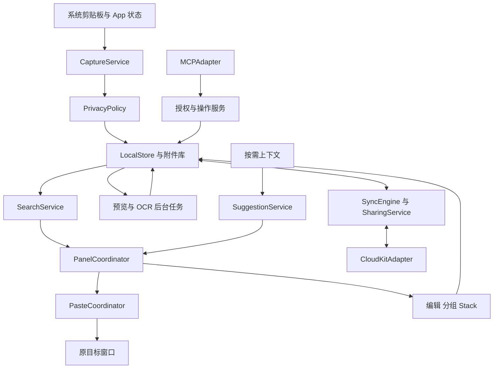
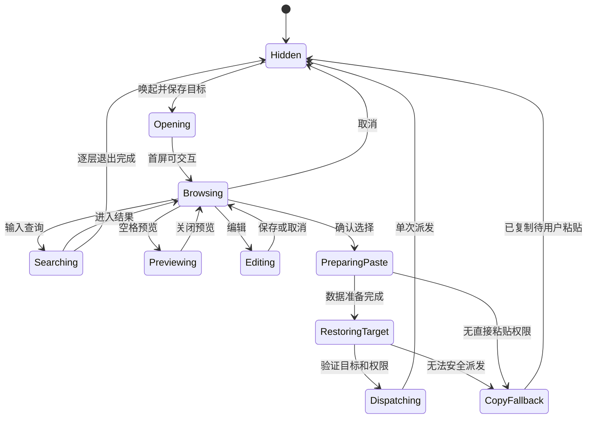

# ClipShelf 技术规格

版本：0.4 Draft · 日期：2026-10-10，Asia/Taipei

状态：原生 macOS 实现持续集成，已进入完整检索选择、原子批量动作和严格撤销验证；尚未完成全量功能与跨 App 验收，具体状态以版本化代码和测试证据为准。

配套文档：[产品动线](PRODUCT_FLOWS.zh-CN.md) · [基准检查清单](BASELINE_CHECKLIST.zh-CN.md)

仓库：[Bestbbb/clipshelf](https://github.com/Bestbbb/clipshelf)

阅读导航：[功能范围](#coverage) · [模块与数据](#architecture) · [跨应用粘贴](#paste-contract) · [同步共享](#sync-sharing) · [验收与里程碑](#acceptance) · [待决问题](#open-questions)

## 1 产品目标与完整复刻的定义

ClipShelf 的目标是免费、开源地实现 Paste 的 macOS 用户功能和交互体验。最高优先级是：用户留在原来的工作上下文中，唤出剪贴板面板，找到内容，粘贴回原窗口的输入位置，然后继续工作。功能数量、界面截图和编译成功都不能替代这条流程的真实验收。

2026-10-09 已确认当前交付范围为 **先完整对齐 Paste 的 macOS 版功能与体验**，包含多台 Mac 同步。iPhone、iPad 应用及其键盘、分享扩展列在 F20，明确不属于当前交付范围，后续另行规划。Mac 上依赖 iPhone 的系统连续互通入口仍按 F15 核验，不等同开发移动客户端。

完整对齐包含采集、面板、搜索、粘贴、预览编辑、Pinboards、Paste Stack、隐私与保留策略，以及同步、共享、OCR、系统集成、智能建议和 MCP。先交付本地核心只是实施顺序，高级功能仍在最终目标中。

独立实现这些行为，采用 ClipShelf 的名称、代码、图标和视觉资产。完整复刻不包含 Paste 的付费墙、订阅验证或其私有服务接口；本项目的本地功能、源代码和正式安装包计划免费提供。

### 1.1 对标基线

- 功能基线：2026-10-09 可访问的 Paste 官方帮助、更新记录及官方 MCP 桥接仓库。
- 当前证据级别：公开文档与公开源码。尚未对安装版 Paste 录制操作、测量性能或完成视觉对比。
- M0A 是公开资料核对与自研原型验证，可立即开展并与实现并行；M0B 是具备可用试用条件后的 Paste 实机对照。没有 Paste 订阅不阻塞公开明确功能的实现和自测。
- M0B 必须记录对标应用版本、构建号、安装渠道、macOS 版本、硬件、屏幕、输入法和授权状态，并使用 M0A 准备的同一套夹具。
- M0B 按实际应用的菜单、设置、内容类型和操作状态逐项枚举子功能，为每项建立基线证据和验收用例；公开帮助中的目录不能单独证明功能清单已经穷尽。
- 对标应用后续更新通过基线变更记录纳入，不让“完整”随网页变化而没有验收边界。
- 本规格中的模块划分、数据表、性能门槛和异常处理是 ClipShelf 的设计方案，不代表 Paste 的内部实现。

### 1.2 完成条件

F01 至 F19 及其实机枚举出的子功能均纳入当前验收，每项都需要正常路径、异常路径、适用平台条件和验证证据。状态使用 `未实现 / 已实现待验证 / 已验证 / 条件受限 / 与基线有差异`，随可追溯实现与测试结果更新；实施已经开始不代表任一完整功能已通过验收。与基线有差异的行为必须登记并评审；未完成项不能从覆盖率分母中移除。F20 不计入当前 Mac 版验收。

### 1.3 文档完成与可行性状态

需求、架构和产品动线已有评审初稿，现已进入原生实现与 M0A 验证并行阶段。尚未完成安装版 Paste 的全量行为基线、全量原生验收及逐子功能的验收映射，因此文档齐全不构成“已证明可以百分之百一致”的结论。产品文档中的 22 个案例是主要场景，不能替代全部子功能与兼容组合的验收。

M0A 优先验证自研实现的跨 App 焦点与直接粘贴、中文输入法、全屏多屏和共享隐藏，并核实同步共享的分发条件、智能能力公开接口及 MCP 公开契约；M0B 再逐项与真实 Paste 对照。公开资料已明确的功能先实现，尚无实机证据的细节保持未知，临时设计明确标记为 ClipShelf 方案。验证结果更新未决项和差异清单；完整对齐声明仍须真实功能、交互与性能证据。

试用前先准备 [基准检查清单](BASELINE_CHECKLIST.zh-CN.md) 的环境、样本和记录模板。官网 Mac 直装版目前提供 7 天全功能试用，无需信用卡且到期不自动扣费；App Store 渠道的订阅规则不同。是否仍具备试用资格须实际确认，准备完再启动，不自动下载安装；试用时长不是开发完成期限。[Paste 官方下载与试用说明](https://pasteapp.io/download)

## 2 技术决策

| 决策 | 本版方案 | 原因与验证条件 |
| --- | --- | --- |
| 桌面技术 | Swift，AppKit 主面板，SwiftUI 设置及辅助界面 | 直接控制窗口、输入法、拖放、Quick Look 和焦点；M0 以真实 App 行为验证 |
| 主面板 | NSPanel 加可复用的 NSCollectionView 卡片 | 面板生命周期由 AppKit 控制，历史内容按需加载；非激活式配置需验证键盘与中文输入 |
| 系统底线 | 暂定 macOS 14 及以上 | 在 M0 确认最低版本和 SDK；智能建议另设系统与硬件条件 |
| 架构支持 | 目标 Apple silicon 与 Intel 的基本功能 | 只在实际硬件通过后声明支持；Apple Intelligence 能力单独标明 |
| 数据 | SQLite，候选 GRDB，附件独立文件 | 数据事务、迁移、索引和备份可独立测试；依赖版本在实施时锁定 |
| 搜索 | SQLite FTS5 加中文分词或 n-gram 索引 | 不能把默认按空格分词视为中文检索已经可用 |
| 图片文字 | Apple Vision，后台任务 | 本地 OCR；语言支持运行时查询，结果不会阻塞采集或粘贴 |
| 同步共享 | CloudKit 私有库与共享库适配器作为优先候选 | 匹配单平台和 Apple 账号动线；M3 前验证分发、容器权限、资产与 CKShare 行为 |
| 智能建议 | 单独的本地上下文与模型模块 | 按系统能力启用；模型不可用时普通历史、搜索和粘贴照常运行 |
| MCP | 本地 Streamable HTTP，附加 stdio 桥接 | 覆盖官方已公开连接方式；逐客户端授权与撤销 |
| 分发 | GitHub Releases 的签名、公证安装包；候选 Sparkle 更新 | 签名身份、更新验签和回滚应在正式发布前验证 |

现有 Tauri、React 和 Rust 文件是早期跨平台骨架，暂不删除，也不把它当作已获验证的技术选型。原生工程现与 M0A 并行实施；未完成的 Paste 实机对照不阻塞公开明确功能开发。CloudKit 与自托管服务不在首轮同时实现；同步业务接口保留可替换性。

AppKit 的 [NSPanel](https://developer.apple.com/documentation/appkit/nspanel)、[SQLite FTS5](https://sqlite.org/fts5.html)、[GRDB](https://github.com/groue/GRDB.swift) 与 [Vision 文本识别](https://developer.apple.com/documentation/vision/recognizing-text-in-images) 是候选实现的直接依据，不能据此推断跨应用体验已经达标。

## 3 功能覆盖与阶段

阶段定义：M0A 公开资料与自研验证、M0B 条件具备后的 Paste 实机基线，两者可与实现并行；M1 核心跨应用操作；M2 本地完整工作流；M3 同步与系统高级能力；M4 全量兼容、性能及发布验收。下文未细分的 M0 同时包含这两条工作线。下表是最低覆盖目录；每行包含的子行为都应展开为实现任务和测试。

| ID | 对齐能力 | 实现责任 | 首次交付 | 验收重点与来源 |
| --- | --- | --- | --- | --- |
| F01 | 文本、富文本、链接、图片、文件、颜色，多项复制及来源信息 | CaptureService、RepresentationCodec | M1，M2 补全格式 | 格式可还原；来源不确定时不伪造；[采集规则](https://pasteapp.io/help/what-paste-captures) |
| F02 | 底部面板、横向卡片、缩放与紧凑模式、多显示器、显示隐藏和焦点 | PanelCoordinator、TargetTracker | M1 | 原 App 输入上下文连续；[Mac 动线](https://pasteapp.io/help/paste-on-mac) |
| F03 | 即输即搜、跨历史及板检索、类型来源日期设备及多板筛选、定位原列表 | SearchService | M1，M2 补全 | 中文、筛选组合、过期查询取消；[搜索](https://pasteapp.io/help/search-and-filters) |
| F04 | 直接粘贴、复制回剪贴板、权限缺失降级 | PasteCoordinator | M1 | 无错目标或重复注入；[直接粘贴](https://pasteapp.io/help/paste-directly-to-other-applications) |
| F05 | 键盘导航、数字 Quick Paste、纯文本模式和修饰键配置 | CommandRouter、PastePlan | M1，M2 配置 | 搜索与结果键位区分；[快捷键](https://pasteapp.io/help/keyboard-shortcuts)、[纯文本](https://pasteapp.io/help/paste-as-plain-text) |
| F06 | 多选合并、拖出、拖入整理、图片作为文件、选择打开文件的 App | DragDropAdapter、PayloadAssembler | M2 | 顺序、格式、临时文件寿命；[图片文件更新](https://pasteapp.io/updates) |
| F07 | Quick Look、文本及文件预览、链接内置浏览 | PreviewService | M2 | 空格开关、不丢选择、无意外联网；[Mac 预览](https://pasteapp.io/help/paste-on-mac) |
| F08 | 新建文本、原位编辑、重命名、撤销、链接修改、旋转、颜色编辑 | ItemEditor、UndoCoordinator | M2 | 正文、表示格式和索引一致；[编辑](https://pasteapp.io/help/edit-items-before-pasting)、[更新](https://pasteapp.io/updates) |
| F09 | Pinboards 创建、颜色、改名、排序、固定、移板和删除 | PinboardService | M2 | 单条单板归属及删除范围；[Pinboards](https://pasteapp.io/help/organize-with-pinboards) |
| F10 | Paste Stack 按序收集、正反序消耗、移除、跨 App 连续粘贴 | StackCoordinator | M2 | 每次只消耗一项，取消不丢项；[Stack](https://pasteapp.io/help/using-paste-stack) |
| F11 | 隐私标记、排除 App、定时暂停、手动恢复、屏幕共享时隐藏 | PrivacyPolicy、PanelCoordinator | M1，M2 完整 | 过滤在入库前执行；共享隐藏逐系统与工具验证；[采集与忽略](https://pasteapp.io/help/what-paste-captures)、[共享显示选项](https://pasteapp.io/updates) |
| F12 | 历史期限、清空、固定条目保留、备份与恢复 | RetentionService、BackupService | M2 | 降低期限前计算影响；[保留](https://pasteapp.io/help/control-history-retention)、[迁移](https://pasteapp.io/help/where-paste-stores-your-data) |
| F13 | 首启、快捷键冲突、菜单栏、登录启动、设置、语言、退出和升级 | AppLifecycle、PermissionService | M1 至 M4 | 首次运行和升级后权限可恢复；[快捷键](https://pasteapp.io/help/keyboard-shortcuts) |
| F14 | 本地 OCR、图片文字检索、命中区域显示、提取文字 | OCRService、SearchService | M2 | 中英文夹具、失败可重试、低置信度不改原图；[搜索](https://pasteapp.io/help/search-and-filters) |
| F15 | 系统分享、Shortcuts 动作、iPhone 连续互通扫描导入 | SystemIntegration | M3 | 桌面入口、系统依赖和取消；[Shortcuts](https://pasteapp.io/blog/paste-with-shortcuts-for-macos-monterey)、[扫描更新](https://pasteapp.io/updates) |
| F16 | 多 Mac 历史和板同步、按设备开关、离线恢复 | SyncEngine | M3 | 幂等、删改冲突、附件完成状态；[iCloud](https://pasteapp.io/help/icloud-sync-doesn-t-work) |
| F17 | Shared Pinboards 邀请、只读或编辑、退出、撤权、停止共享 | SharingService | M3 | 权限由远端执行，离线边界明确；[共享板](https://pasteapp.io/help/shared-pinboards) |
| F18 | Intelligent Clipboard 建议和独立的系统 Writing Tools | SuggestionService、WritingToolsAdapter | M3 | 能力与权限门禁、上下文释放；[智能建议](https://pasteapp.io/help/intelligent-clipboard)、[编辑](https://pasteapp.io/help/edit-items-before-pasting) |
| F19 | MCP 连接、检索读写、板管理、逐客户端授权撤销 | MCPAdapter | M3 | 11 个工具和权限矩阵；[Paste MCP](https://pasteapp.io/help/paste-mcp)、[官方 manifest](https://github.com/pasteapp/paste-mcp/blob/main/manifest.json) |
| F20 | iPhone、iPad、移动键盘、分享扩展、小组件 | 独立移动端工程 | 当前范围外 | 后续另行规划，不计入当前 Mac 版验收；[移动端](https://pasteapp.io/help/paste-on-iphone) |

产品入口对应：[采集](PRODUCT_FLOWS.zh-CN.md#u02)、[唤起与粘贴](PRODUCT_FLOWS.zh-CN.md#u03)、[搜索与键盘](PRODUCT_FLOWS.zh-CN.md#u04)、[预览编辑](PRODUCT_FLOWS.zh-CN.md#u06)、[板](PRODUCT_FLOWS.zh-CN.md#u07)、[多选拖放](PRODUCT_FLOWS.zh-CN.md#u08)、[Stack](PRODUCT_FLOWS.zh-CN.md#u09)、[隐私](PRODUCT_FLOWS.zh-CN.md#u10)、[保留备份](PRODUCT_FLOWS.zh-CN.md#u11)、[同步共享](PRODUCT_FLOWS.zh-CN.md#u12)、[系统集成](PRODUCT_FLOWS.zh-CN.md#u13)、[智能建议](PRODUCT_FLOWS.zh-CN.md#intelligence)、[MCP](PRODUCT_FLOWS.zh-CN.md#mcp)、[首启](PRODUCT_FLOWS.zh-CN.md#u01)、[生命周期](PRODUCT_FLOWS.zh-CN.md#u14)。

## 4 模块边界

窗口和系统输入调用在 MainActor；数据库使用串行写入与一致性读事务；OCR、图片解码、索引和网络走可取消的后台任务。面板呈现不等待 OCR、同步、智能建议或大图解码。所有入口复用同一套数据操作与权限规则，MCP、Shortcuts 不能绕过隐私和共享板权限直接写数据库。

| 模块 | 输入 | 输出与边界 |
| --- | --- | --- |
| CaptureService | 剪贴板变化计数、表示格式、来源线索 | 一致的 CaptureSnapshot 或结构化跳过原因 |
| PrivacyPolicy | App 标识、系统标记、暂停状态、用户规则 | allow 或 deny；不把敏感正文送入日志或模型 |
| LocalStore | 已通过过滤的快照、编辑和删除命令 | 事务化条目、附件引用、变更版本及待同步操作 |
| PanelCoordinator | 用户命令、查询结果、TargetContext、共享显示偏好 | 选择、预览、退出、PasteIntent；统一窗口捕获保护策略，不直接注入键盘 |
| PasteCoordinator | 明确选择、输出模式、原目标上下文 | copied、dispatched、cancelled、failed；不把 dispatched 等同实际插入 |
| SearchService | 文本、结构化筛选、分页游标、请求版本 | 稳定有序的结果及匹配字段 |
| SyncEngine | 本地 outbox、远端增量、设备状态 | 可重试同步，不向系统剪贴板写入远端内容 |
| SuggestionService | 用户启用时的短生命周期上下文 | 建议条目 ID，不修改正文、不自动粘贴 |
| MCPAdapter | 已授权客户端的类型化请求 | 范围内数据与操作结果，不接收任意脚本或系统命令 |

## 5 数据与持久化

### 5.1 逻辑模型

一次复制可能包含多个文件或对象，每个对象又有多种表示格式。必须保留这两层顺序，不能把全部复制内容压成一个字符串或一张 PNG。

| 实体 | 关键字段 | 不变量 |
| --- | --- | --- |
| ClipItem | UUID、创建时间、最近采集时间、origin、类型、标题、来源及可信度、revision、deletedAt | ID 不随标题、编辑或同步变化 |
| ClipPart | itemID、ordinal | 表示一次复制中的第几个对象 |
| Representation | partID、UTType、blobID、字节数、完整性状态 | 同一对象保留纯文本、RTF、HTML、图像等可用原始表示 |
| Blob | UUID、相对路径、本地校验和、大小、引用数 | 原子落盘；禁止由剪贴板内容指定任意写入路径 |
| HistoryEntry | itemID、排序时间、可见状态 | 历史可见性与是否钉选分别管理 |
| Pinboard | UUID、名称、颜色、排序值、共享标识、版本 | 一个条目在同一时刻最多归属一个板 |
| PinMembership | itemID UNIQUE、boardID、排序值、版本 | 移板是移动归属；历史仍可引用同一条目 |
| DerivedContent | itemID、sourceRevision、预览、OCR 文本及坐标、索引状态 | 旧版本计算结果不能覆盖新版本 |
| StackSession | 会话 ID、方向、状态、待消耗条目顺序 | 临时队列；重启恢复策略需与 M0 基线对照 |
| OutboxOperation | UUID、entityID、baseRevision、操作、重试信息 | 本地业务写入和入队同事务提交 |
| SyncState | 设备 ID、账号命名空间、增量令牌、共享库状态 | 不跨 Apple 账号复用令牌或队列 |
| Tombstone | entityID、删除版本、同步确认状态 | 离线旧数据不能复活已删除对象 |

字符串保存 Unicode 原文；检索归一化另存索引。不能为了搜索改写正文、代码缩进、换行或颜色文本。原始 RTF/HTML 与编辑后的表示要按 revision 更新，不能出现预览显示新内容而粘贴旧内容。

来源优先读取可验证的剪贴板来源标记，再使用采集时前台 App 作为线索；标记、前台 App 都不构成安全身份。Universal Clipboard、后台应用或桥接程序的来源可能未知，界面应允许显示“来源未知”。

### 5.2 文件和附件

文件条目保留 URL、必要的持久访问凭据及显示元信息。文件引用与完整文件副本分开：原文件移走或失去权限时不能宣称可恢复；同步一个路径不等于同步文件。M0 需确认 Paste 对文件持久化与多 Mac 文件可用性的实际行为。

图片原件、缩略图和导出的临时文件分开存储。图片作为文件拖放时使用受控导出目录或系统 file promise，在接收应用完成读取前保留文件；生命周期根据回调和超时清理，不能在拖放结束瞬间无条件删除。

图片文件输出逐记录、逐剪贴板对象处理：包含图片而不包含文件引用的对象转为PNG，其余对象原样保留；不只导出首张图片。转换使用后台ImageIO，应用方向信息；动画或多帧源在该PNG模式下输出首帧，普通图片拖动仍保留原表示。单次转换最多64 Mi像素和512 MiB PNG字节，坏图、失效文件或超限使整批准备失败。此限制不代表进程RSS上限。

ClipShelf当前交互为按住Option拖出图片文件；单板手动排序下Option仍切换为内容拖出，其中图片转为文件。文件拖动使用原生NSFilePromiseProvider，在接收方给定的URL写入，provider持有自己的字节及delegate，不依赖临时缓存期限。菜单另提供“复制为图片文件”和“作为图片文件粘贴”，使用独立临时PNG并保留至少24小时，之后仅在后续导出时清理；剪贴板URL的保留期限不等于目标App已接收。失败或过期的异步回执清理尚未输出的本批文件，不删除外部替换内容。转换完成后重新核对冻结选择和输出权限，并沿用原目标/光标的PasteCoordinator；复制成功与实际按键派发分别报告。上述Option映射和PNG策略为ClipShelf当前方案，尚未与Paste实机对照。

写入采用“临时附件写完并校验 → 原子重命名 → 数据库提交引用”。崩溃产生的孤立附件由启动清理回收。删除先移除对象引用，等待撤销窗口与同步约束满足后回收；缓存和 OCR 索引一并失效。

### 5.3 索引与迁移

FTS 索引覆盖正文、用户标题、链接元数据和 OCR；来源、类型、日期、设备、板使用结构化列。中文短词、中英混合、网址片段、emoji 和代码标识符需要独立夹具，M0 决定分词器与子串兜底。所有查询参数化，输入不得被直接拼接为 FTS 语法。

数据库 schema 递增版本。迁移前生成一致性备份，失败时保留原库、停止新版本写入并提供恢复。备份采用 [SQLite backup API](https://sqlite.org/backup.html) 或一致性快照，附带附件清单、schema 版本与校验和。直接复制正在写入的数据库不作为备份方案。

当前schema13健康资料库重开时不重复执行历史回填：内容/排序同步头仅在schema7之前升级时建立基线，清理token仅在schema10之前升级时回填。取得写锁后重新读取schema版本，避免另一个连接已完成升级时仍按旧版本执行；版本升级与回填仍在同一写事务完成。平时写入、更新、删除、同步和恢复继续原子维护这些状态。当前版本缺少必要表、约束或清理触发器时拒绝打开，不从总同步头猜测重建已分叉的内容头；单行清理token缺失在使用清理计划时明确拒绝，不能把缺失当作已验证。健康重开只做结构检查，不以新的全表校验替换原有扫描。

## 6 采集与隐私处理

`NSPasteboard.changeCount` 用来识别所有权变化，[Apple 文档](https://developer.apple.com/documentation/appkit/nspasteboard/changecount)没有提供完整历史事件队列保证。初始方案轮询变化计数，仅变化时读取实际内容；轮询间隔在 M0 平衡捕获延迟与能耗。短于采样窗口的连续覆盖可能丢失，必须测量，不能承诺无限速零漏采。

处理次序：

1. 检查用户是否启用采集、是否暂停、会话是否锁定，以及来源排除规则。
2. 检查 confidential、concealed、transient 等已知类型标记；命中即结束，不生成预览、OCR、索引或上传。
3. 读取 `changeCount` 与条目类型，提取允许的对象和表示，再次核对计数。过程中变化则丢弃该次不一致快照并读取新状态。
4. 被动采集在读取载荷前检查本程序回写标记，避免“粘贴回写 → 再采集”的循环；不在回写回调中读取最新计数并跳过，以免吞掉紧接着的新复制。用户通过 Services 或拖入明确导入时允许自家输出，剥离内部标记，但仍拒绝敏感标记。
5. 冻结每个对象的原始表示、来源提示与观察时间后，按顺序在后台解析摘要、计算本地去重标识、写入内容、历史关联及 outbox，然后更新 UI。
6. 在后台生成缩略图、OCR 和检索派生数据。结果必须匹配源 revision。

当前实现每300ms观察一次。`NSPasteboard`/item读取留在MainActor，每个表示只读一次，仅不可变Data快照传到后台。缺少已声明的表示时不保存残缺条目；同一计数最多尝试3次，空结果也有限重试，永久空内容静默结束。读取前后复验运行代次、来源、计数与敏感/内部标记；新的变化有独立尝试机会。允许的App切换发生在尚未捕获的复制之间时保留内容但将来源记为未知；跨排除App切换丢弃不确定变化。前台App只是提示，不证明真正的写入者。

单快照表示总量上限64 MiB；FIFO队列最多32项、保留的输入表示累计128 MiB（包含活动和失败项），不承诺进程RSS上限。队列满时暂停采集并明确本次复制未入队；保存失败保留队首与后续输入，暂停直到用户重试或丢弃。重试沿用冻结内容与时间，不能从已变化的剪贴板重新取值。失败待保存内容仅在内存，退出前确认；已开始写入时暂缓退出和更新重启。失败状态允许用户先清理历史，再重试。含文件引用的待保存项会保守延后托管文件物理回收，需先重试或丢弃这些项；仅文本失败不阻止空间回收。

手动/定时暂停、锁屏及排除策略变更取消等待保存的内容和旧回执；正在执行的数据库事务可能仍提交，完成后刷新历史但不恢复旧状态或将结果加入另一Stack会话。恢复采集建立新基线，不补采旧剪贴板。剪贴板IPC/延迟载荷物化仍在主线程，本轮只把解码与数据库保存移出，实际交互延迟仍须测量。

默认保留原始格式，纯文本选项只影响输出计划。[Paste 采集规则](https://pasteapp.io/help/what-paste-captures)中的颜色识别应单独测试：六位十六进制、前缀或字母要求，纯数字、短码和混合文本的差别。不能把任意六位验证码当颜色。

重复采集按相同来源、最初采集设备、正文和全部原始格式逐字节确认，在全库候选中复用同一记录并更新复制时间及本地历史位置，覆盖 A→B→A；保留已有名称、分组和 OCR。正文相同但来源、格式或多对象顺序不同仍为独立条目；不自动清理既存重复记录。使用有界正文前缀与来源索引缩小候选，校验原件描述后再读取匹配载荷。选区仅接受持久化回执对精确前一版本的更新，编辑草稿保持原快照。

暂停期间推进观察基线，恢复时不补录暂停期间留下的剪贴板内容；首次启动先建立基线，避免意外导入启动前内容。这两项是 ClipShelf 的隐私方案，记录到差异表并核对 Paste 实际行为。不能保证识别未带标记的全部密码，设置中必须能排除应用并解释检测边界。

## 7 面板与跨应用粘贴

### 7.1 状态和目标上下文

每次唤起保存 `TargetContext`：进程身份、应用标识、可获得的原窗口和聚焦控件引用、显示器、唤起时间及上下文代次。只保存定位所需信息，不读取或记录目标输入框正文。搜索、Quick Look、设置和权限窗口都不得覆盖最初目标。

面板以当前工作显示器的可见区域定位，考虑 Dock、菜单栏、不同缩放、屏幕拔插及全屏空间。显示器选择规则、面板高度范围、紧凑模式阈值和动画曲线以 M0 测量确定，不能用猜测的像素值标作 Paste 一致。

当前普通与紧凑模式分别保存用户调整的高度；重新显示和切换模式时，按目标屏幕可见范围限幅，临时的小屏限幅不覆盖原偏好。再次唤起未保存草稿时移动现有主面板与编辑器，保留正文、选择、撤销栈和输入焦点。几何回归使用合成屏幕，不替代真实多显示器、全屏或屏幕拔插验收。

当前入口采用可取消的短距离上移与淡入，窗口尺寸和最终位置仍由同一几何规则决定；显示时立即允许搜索和键盘选择，不等待动画完成。暂定参数为140 ms、最多18 pt，属于ClipShelf自身设计，尚未取得Paste同场景测量。已显示时重复呈现不重播入口，恢复未保存草稿直接显示既有父子窗口。实际执行收起时立即隐藏并退休动画；Esc保留先清空搜索及确认未保存草稿的既有行为。旧进度和完成回调不能移动、重新显示或改变新一轮窗口。调整大小、切换紧凑模式及重新定位前停止旧动画，避免覆盖新几何或误存用户高度。

每次显示读取系统“减少动态效果”；开启时直接显示最终位置，运行中的设置变化也结束位移并到达最终位置。使用[NSWorkspace的系统偏好](https://developer.apple.com/documentation/appkit/nsworkspace/accessibilitydisplayshouldreducemotion)与显示选项变化通知。全局快捷键到可操作首屏的耗时与完整动画时长分别验收，不能用预设动画时长证明120 ms唤起指标。

对齐 Paste 的“Show during screen sharing”设置，PanelCoordinator 统一管理主面板、Quick Look、编辑与 Stack 等含内容窗口的捕获保护。M0 分别记录默认值、应用范围，以及整屏共享、单窗口共享和录屏结果；使用公开系统能力实现，无法可靠隐藏的组合明确标为受限。不能把某一窗口配置等同于所有 macOS 版本、会议工具或截图方式都不可捕获。这是内容展示控制，与智能建议申请的屏幕读取权限分别管理。[官方更新记录](https://pasteapp.io/updates)

输入焦点必须区分搜索、结果、编辑器和输入法候选。中文组合输入期间的 Return、Space、方向键先交给输入法；选词不能触发粘贴、Quick Look 或移动卡片。非激活 NSPanel 是否能完整支持这些状态由原型验证。

当前 F04/F10 接线用 `ApplicationInteractionLifecycle` 统一处理交互边界：新唤起先检查会话和退出状态，取消待派发粘贴、Stack 积压请求及旧建议，再次检查状态后才显示或切换面板。即使旧面板已隐藏，也不能让上一次等待修饰键释放的粘贴进入新一轮交互。取消旧输出不等于放弃编辑草稿；显式关闭仍按草稿确认流程处理。

外部 App 激活事件交给 `PasteCoordinator` 检查正在进行的目标，不依赖主面板是否可见；切到其他 App 后再切回，也不能复活已取消的请求。Space 变化独立使上下文失效，即使前台进程未变也取消旧输出和建议，清除目标并隐藏历史与 Stack 浮层。会话挂起、锁屏或休眠路径同样取消输出并保留未保存草稿，立即停止 Stack 按键监听；恢复后不自动派发挂起前的请求。`onDismiss` 清除面板目标，下次唤起重新捕获。退出时撤销 Space 监听，旧代次的延迟通知不能再触发动作。

这些是应用层取消契约。2026-10-10解锁后的桌面验证已覆盖部分编辑流程，但实际锁屏通知交付、Space切换、焦点恢复和跨App输入结果仍未完成验收，不能以注入通知或未显示窗口的验证替代；最新证据见[实现状态](IMPLEMENTATION_STATUS.zh-CN.md)。

### 7.2 粘贴事务

`PasteIntent` 包含选择的条目及其 revision、有序选择、输出模式、目标上下文代次和唯一 attemptID。输出模式至少有保留格式、纯文本、图片作为文件、复制到剪贴板。

1. 冻结当前选择，防止历史新增或搜索结果刷新改变此次输出对象。
2. 在单一数据库读快照内校验全部所选 `(id, revision)`，先预检整批原始内容字节，再加载表示；完成所有转换后才替换系统剪贴板。任一条目失效、附件损坏或整批超限均失败，不能跳过失败项继续输出，失败时保留用户原剪贴板。
3. 校验目标仍存在、会话未锁定、权限有效，检查用户是否已主动转到另一应用。
4. 写入原始多格式内容及内部回写标记。纯文本只输出文本表示，不改历史原件。
5. 收起面板，尝试恢复原应用及窗口，等待实际激活状态；[activate](https://developer.apple.com/documentation/appkit/nsrunningapplication/activate(options:)) 返回成功也不等于插入成功。
6. 核对目标前台身份和可用焦点，普通面板粘贴等待用户修饰键释放，再派发一次 Cmd-V。Stack 允许仅保持 Command，便于连续独立按下 V；Shift、Control、Option 仍须释放。创建按键后、实际发送前再次核对请求、剪贴板、前台、窗口、控件及修饰键。不向错误前台发送，不额外发送 Return。
7. 返回派发状态。目标退出、焦点改变或无法验证时转为“已复制，请在目标应用粘贴”；禁止自动重试造成重复插入。

Paste 官方说明直接粘贴使用辅助功能权限并向前台发送 Cmd-V；无权限时退回剪贴板复制。[官方说明](https://pasteapp.io/help/paste-directly-to-other-applications) 同样构成本项目的降级验收参考。

普通第三方应用没有统一的“内容已插入”回执。`dispatched` 仅表示命令已派发；只有受控测试目标或用户观察能证明插入位置和内容正确。不能依赖固定 sleep 后无条件发送按键，也不能把 AX 权限存在视为一切应用均可写入。

### 7.3 键盘与多项行为

全局快捷键只负责唤起面板及 Stack；面板命令按当前焦点路由，避免截获其他 App 的普通输入。全局注册机制在 M0 验证冲突、系统占用、Secure Input 和权限需求，不能假设能绕过系统限制。

可配置项为四组完整按键组合（激活面板、激活 Stack、上一个板、下一个板）和两个单独修饰键（Quick Paste、纯文本），其余应用内命令保持固定。默认分别为 `⌘⇧V`、`⌘⇧C`、`⌘←`、`⌘→`、Command、Shift。Quick Paste 与纯文本修饰键不能相同；四组组合不能重复或覆盖固定命令、当前数字 Quick Paste 或纯文本 Return。全局组合必须包含 Command、Control、Option 中至少一个，或使用 F1–F20；局部板切换不套用这一全局限制。

设置修改先作为草稿。录制和修饰键变更后即时校验，并临时尝试注册尚未持有的全局组合，随后释放探测句柄；探测只证明当时可注册，不保证保存时仍可用。保存前重新校验与编码，再注册全部新增组合；全部成功后才切换动作映射、释放旧组合并写入偏好。任何新增注册失败只释放本次新增句柄，现有可用注册及整份偏好保持不变。面板与 Stack 交换组合时复用已有句柄，避免先注销后重注册。启动逐项注册并报告失败，保留另一项可用组合。恢复默认只重置六个快捷键字段，保留独立的“始终纯文本”选择，仍须保存后生效。

持久化保存真实 keyCode 和四种修饰键的掩码，不保存输入法生成的字符。当前布局通过 TIS/UCKeyTranslate 按真实修饰键解析显示和固定字符命令冲突，包含 Dvorak–Qwerty Command 这类按住 Command 后改变映射的布局；面板按实际事件字符使用相同固定命令分类，不能只取忽略修饰键后的字符，并优先于自定义板切换。键盘布局改变时刷新标签、结束录制、逐项检查全局组合：注销新产生冲突的组合，保留安全组合；布局恢复后尝试重新注册，系统占用仍单独报告。未知布局只能使用明确标注的 ANSI 显示回退，不能据此判断 Command 字符组合安全。Carbon 先截获已注册组合时，仅在设置窗口为主窗口且正在录制时转交录制器，不执行原全局动作；失焦或取消结束录制。

配置采用版本化 schema。没有新版配置时，将旧 `shortcutPreset` 的 0/1/2 映射为原唤起组合，其余字段采用默认值；加载不自动写回。损坏、未知版本或当前布局下不合法的配置保留原始数据，明确提示并暂用默认值，用户成功保存后才替换。

完整键位与鼠标动线见产品文档。重要不变量：搜索框第一次 Return 进入结果，结果上的 Return 执行粘贴；默认 Cmd-1 至 Cmd-9 对应当前可见列表，可配置的 Quick Paste 与纯文本修饰键驱动数字、Return 和双击；重复 keyDown 不重复派发；Escape 按当前交互层级退回。`⌘↑` / `⌘↓` 定位完整查询的首尾项；带 Shift 时扩展至既有冻结选择集合的首尾，后台新增不能混入。第一次 `⌘F` 聚焦搜索，搜索已聚焦时再次按下进入全部筛选。两项代码契约见 8.1，集成与实机状态分别记录，不能只凭实现宣布验收完成。

模型、模拟注册器和未显示窗口的控制器测试只证明配置与路由契约。真实系统热键交付、输入法组合态、非 US 布局切换、Secure Input 及跨 App 行为仍需独立实机验收。

多选保持稳定输出顺序。文本分隔、混合文本图片、多文件、RTF 合并规则必须用 Paste 基线决定；在规则未验证前，不可把“已经写入多个 NSPasteboardItem”视为任意目标都能接受。不同目标不支持的组合要有明确降级和逐项工作流。

当前ClipShelf原格式输出仅合并可完整读取的单对象普通文本：无parts的旧文字记录，或只含UTF-8/RTF表示的单part，且正文与摘要一致、富文本无附件。合并按冻结选择顺序添加换行并保留RTF属性。任何条目含多个对象、HTML、URL专用表示、UTF-16、未知格式、附件或相互不一致的正文，则整批保留原记录/对象顺序及表示字节；RTF解码或合并编码失败同样保留原对象，不静默退为无格式正文。已有parts时以part载荷为准，不用顶层RTF覆盖它。

显式纯文本输出是独立转换：逐对象优先取实际URL或Safari地址列表，再取可读UTF-8/UTF-16正文或无附件RTF文字，按顺序加换行；不执行HTML、不读取远程资源，不用标题、OCR或卡片摘要填补缺失对象。任一对象没有可读文本则整批拒绝，保留现有系统剪贴板；空文本与无法读取区分。带真实文本表示的PDF可转换，文件和图片保持不可转换；旧无parts记录继续使用保存的text正文。两种输出均不修改历史原件。

### 7.4 Stack 请求与消费 F10

Stack 使用独立临时队列。每次采集都有独立的 `occurrenceID`，同一历史条目重复出现也保留各次复制。队列内容与待执行的粘贴请求分开管理：每次独立的物理 `⌘V` 按下产生一个请求，多个请求按到达顺序串行执行；长按产生的自动重复不增加请求，内部合成的粘贴按键不被再次截获。可以保持 Command，释放并再次按下 V 以请求下一项。

按键回调只冻结前台 PID 与交互代次，不在系统输入回调内执行 AX RPC。异步动作开始时、读取 AX 之后、轮到队列执行及最终按键派发前均复核上下文；任何应用激活通知或显式取消都会使旧代次永久失效，包括 A→B→A。无法取得有效目标时不改为当前的新目标输出。

每个请求保留该次按键对应的目标；轮到执行时才按当前方向选择队列项，冻结其记录、文件租约和 `occurrenceID`。切换方向只影响后续尚未开始的请求，不改变正在派发的项。仅收到 `dispatched` 才按该 occurrence 消费，不能按此时的新队首消费，也不能让迟到或重复的完成回调删除别的项。`dispatched` 仅表示已发出按键，不表示目标已经插入内容；恢复上一项会生成新的 occurrence，旧回执不能消费恢复项。

每次派发后保留 200ms 剪贴板交接窗口，期间积压的下一项不能覆盖剪贴板；窗口结束仍按上述上下文和权限规则决定是否执行。此窗口缓解按键提交后立刻覆盖数据的竞态，不是目标应用的读取或插入回执；目标卡顿、读取超过窗口或其他程序改写剪贴板时仍不能保证端到端结果。受控延迟读取测试只证明窗口内的顺序保护，真实慢应用与多项连续输入仍是交付验收项。

复制降级、失败、取消或忙碌结果均保留当前项，并取消已经积压的后续请求。再次尝试需要新的物理按键，不自动重发或跳到下一项。结束、清空或移除正在派发的项也使相关请求失效。队列用完时恢复普通粘贴，但 Stack 会话可以继续收集，并保留恢复上一项的入口；这不承诺跨进程重启恢复临时队列。

按键拦截只在会话允许交互、主面板未显示、ClipShelf 没有 key window 且队列非空时接管新的 `⌘V`。搜索、编辑器、设置窗口及原生输入控件保留自身粘贴行为。已经接管的物理按键即使因最后一项消费或结束队列而不再接受新请求，其后续自动重复和 key-up 仍须排空，避免最后一项意外再贴一次；会话挂起或锁屏则立即停止监听并使排队回调失效，不等待按键释放。

以上为当前 ClipShelf 契约。持续按 Command 的连续请求、改变方向时的在途派发、自家输入控件、失败后重试及锁屏恢复，仍须在解锁后的真实目标 App 中核验；Paste 的精确推进与恢复体验继续按 M0 基准观察记录。

## 8 搜索 预览 编辑和整理

### 8.1 搜索与排序

查询状态包括文本、类型、来源应用、日期范围、设备和 `pinboardIDs` 集合。搜索默认跨历史与 Pinboards，不能把当前板误当作唯一搜索范围；显式选择单板或多板后才应用板条件。各维度及多板之间的组合关系由 M0 冻结，验收覆盖单板、多板、清除条件和空结果。单选结果支持 Cmd-G 定位回所在历史或板。结果使用稳定 itemID 选中；后台新增条目不能让 Quick Paste 数字在一次按键事务中漂移。

每次查询分配 generation，新查询取消旧工作，返回时核对 generation。首次加载分页展示元数据和缩略图；大文件、原图、完整富文本在预览或输出时按需读取。无匹配、索引尚在更新、同步附件未就绪须分别呈现。

分页调度只允许一个实际执行的后台读取和一个最新等待请求；连续输入替换等待项，并取消正在读取的任务。旧工作实际退出前不启动下一项，迟到成功或错误都不更新界面。读取分页、分组、来源及设备选项时使用单次取消令牌；等待连接锁可提前退场，活动SQL通过锁内限定的SQLite progress handler退出，移除回调后才提交/回滚，不使用会影响其他事务的全连接中断。Swift按行解码间检查取消，单个Foundation解码调用不能中途终止。

首次异步读取显示加载状态，只有当前成功回执才能显示真实空历史或无匹配；读取失败提供重试。已有页在刷新失败时保留，但与当前条件不匹配的旧页不能输出。隐藏或退出取消后台请求；保留草稿的隐藏路径同时退休分页状态，再次显式唤起重新读取原条件，旧回执不能使列表停留在加载中。

当前实现一次展示最多 300 条元数据，定位按条目 ID 在同一数据库读快照内确定位置并取页；目标删除或不再符合条件时报告失败，不改选相邻项。普通分页因删除而越界时退回有效窗口。展示窗口不限制选择范围：列表中的 Cmd-A 选择完整查询结果，Shift 跨页扩选使用冻结的有序轻量引用；后台新增不自动加入，已选条目删改使本次选择失效，不能静默丢项或替换成邻项。查询与会话变化会使旧选择回执失效，普通翻页保留选择。具体批量与撤销契约见 8.4。

普通首尾导航使用显式 `HistoryPageBoundary.first/last` 请求，与 offset、anchor、displacement 导航互斥，不以特殊整数作为指令。Core 在同一读取快照内按完整过滤与排序确定边界及窗口；末尾计数与分页读取不能跨快照。每页最多 300 条元数据，不为跳到末尾读取全量引用或附件；返回准确 `focusID`，空结果为 offset 0、无焦点、无后续页。UI 接收时检查首项/末项位置、窗口大小和请求代次。

Shift 首尾导航复用已有冻结结果集合；尚未冻结时先取得完整有序 `(id, revision)` 快照。扩展范围先写入临时选择副本，按冻结端点严格定位窗口，核对页内选中项版本并校验完整候选引用后，才一起提交窗口与选择。目标失效或任一选中项被修改、删除时拒绝，不改选新的边界。输入新查询、变更会话、转入搜索/筛选或后续选择会使旧请求失效；迟到回执不能覆盖新的焦点与选择。

全部筛选使用 `HistoryQuery` 的草稿副本，包含类型、来源 App、设备、开始/结束时间、多个板及排序。修改、取消、Esc 或关闭弹层不提交；应用前检查日期有限且起点不晚于终点、所选板仍存在、手工排序恰好对应一个板，再一次性更新条件并发起一条新查询。关键词不由弹层改写；“清除筛选”只清除条件，保留关键词与排序，因此清除板后若仍选手工排序，必须选择一个板或显式改为最近复制才能应用。

选项列表刷新不得静默丢失草稿条件。已不可用的来源 App/设备继续展示并保留，说明结果可能为空；已不可用的板保留勾选项并阻止应用，用户明确取消后才移除。草稿回执绑定面板会话及查询范围，旧弹层不能覆盖后来的查询。以上为当前集成契约，统一测试与真实 UI 验收见实现状态文档。

设备筛选指首次由哪一个 ClipShelf 安装实例采集或创建。安装 ID 独立于同步账号及可迁移的逻辑备份；同步、编辑、排序和恢复保留来源证据。旧记录无来源时显示未知；同一记录出现矛盾的已知来源时持续标记未知冲突，不任取一个设备，也不能被旧版本传来的空字段覆盖。该字段是来源提示，不是设备身份认证或 Universal Clipboard 原始物理设备证明。

schema v8 用 FTS5 trigram 筛出候选，再以原来的 `lower`/`instr` 校验完整字面子串；中文短词、符号和不支持索引的 SQLite 保留扫描路径。索引与正文在同一事务更新。核心查询基准与端到端输入延迟分别验收，不能互相替代。已保存的 schema v8 检索测量对应提交 `e78ef3f`，对照提交为 `45edfd6`；现已另存提交 `08f4998`（schema v12）的同夹具 release 测量，覆盖 10k × 100 次、100k × 30 次的同步 `searchMetadata` 查询与元数据解码，原始样本及环境见[基准记录](../native/Benchmarks/README.md)。该测量不覆盖后续更新器/发布/容量计量改动、真实 UI/IME/debounce/绘制、facet 聚合、深页与选择、附件 payload 解析/输出或 GC，不能用于宣称端到端输入延迟已验收；旧schema12的单次开库值不作因果结论；后续schema13的重复开库对照已单独记录于同一基准文档，定位并移除了健康库每次启动的全表回填。

OCR 是可延迟的派生结果。保存识别语言、引擎版本、源 revision、置信度及原图归一化坐标。旋转图片后重新计算坐标和文字；不会拿旧坐标高亮新图。搜索夹具含简体、繁体、英文、中英混排和低清图片，低置信度结果不能静默替换正文。

### 8.2 预览与原位编辑

Quick Look 或应用内预览按内容类型选用，关闭后恢复原卡片选择和横向位置。文件失效时显示可定位原件的动作；不把预览缓存当作可粘贴原件。

多对象记录的Space和菜单预览先进入独立对象选择器，按原始part顺序列出全部对象。`ClipboardPartPreviewPlan`只读取所选part的表示，不借整条记录的摘要、RTF、HTML或OCR补内容，也不复用要求可编辑的投影函数。原生RTF/RTFD只读展示保留内嵌附件；图片显示有界缩略图；PDF可翻页/缩放；文件只显示保存的地址，再显式进入既有完整文件状态窗口；HTML-only显示源码，不发起资源请求。未知、损坏、加密或超过预览上限的表示仍可查看类型与字节数。多帧图显示首帧并标明部分预览，原件不改变。

预览解码仅允许一项执行及一个最新等待选择。切换、关闭、隐藏、重开或父范围变化退休旧请求；不能中途终止的原生解析可以结束，但迟到结果不得显示或触发编辑。文字预览取最多1 MiB前缀，富文档输入上限8 MiB，图片/PDF输入上限32 MiB，图片源尺寸上限100MP、缩略图最长边2048像素，PDF上限500页。原生解析后的对象开销不构成严格RSS保证。链接和附件不自动外部打开。

“编辑”回调携带完整原记录和原part下标，再取得最新编辑快照；只读预览不取得写权限。文件管理同样传完整原件；已支持的首图旋转/OCR入口保留。多对象预览不创建局部记录用于输出，返回列表后复制/粘贴仍处理完整记录；父列表误收Return或Quick Paste不得在预览后方派发内容。该选择器为ClipShelf方案，尚未与Paste实机对照；完整附件编辑、后续图片的原位修改仍是独立差距。

文件预览通过“文件与位置”列出全部文件槽位，区分可用、丢失、不可访问、无效引用及托管副本路径异常；缺失项不从列表消失。实际 Quick Look 与外部打开由用户逐项发起，动作前重新检查当前记录和文件状态。选择器与异步回执绑定窗口、会话及记录版本，关闭或切换上下文后旧回执不再发起修改或覆盖新状态。

外部文件重新定位使用单项文件/文件夹选择，提交时核对资料库、双账号配置代次、revision、原始槽位及可写权限。仅保存所选引用，不复制外部文件、不认领托管资格，也不宣称验证了它与旧原件的身份。受影响的剪贴板对象规范成新文件 URL，移除可能指向旧文件或包含旧内容的表示；其他对象保持顺序与原始表示。自定义标题保留，自动生成的文件名摘要才随新名称更新。操作接入严格编辑撤销，可恢复旧表示及原先失效的路径；撤销不移动或删除真实外部文件。

托管原件完好而打开副本丢失时提供显式重建：验证已登记原件摘要，在受控目录完整写入后以不覆盖方式发布。已存在的副本即使被外部编辑也保留；原件损坏时不采用预览缓存替代。重建属于本机文件维护，不改记录、revision或云队列，不登记内容编辑撤销；当前只读共享可用，撤权或账号变化则拒绝。普通与托管文件的复制/粘贴/拖出仍要求全部文件可用，不能静默跳过失败项。真实接收 App 的可访问性另行验收。 历史输出在同一读取快照校验记录版本、账户可读权限与托管副本安全；复制、Quick Paste、拖出及系统分享共用此入口。预览、修复与删除仍可解析失效引用。Stack 保留每次复制的快照，不因历史合并后的版本变化失效；输出时检查引用命中的本机登记副本，不据此赋予托管所有权。

“打开方式…”列出macOS为所选文件提供的本机应用，标记默认项并对同名应用显示路径；“其他应用…”仅选择应用包。选定应用后再次验证记录、原始文件引用、账号配置和文件可用性，再调用系统指定应用打开接口；只读条目仍可读取打开。取消、关闭或上下文改变不会发起旧打开请求；失败保留窗口并可重试。此操作不更改系统默认文件关联。

链接元数据与内置网页预览会产生网络访问，必须独立于普通剪贴板采集。默认先显示本地 URL，首次联网预览说明行为；这是待评审的隐私差异。WKWebView 使用隔离的数据容器，不暴露数据库或应用命令桥，不自动打开自定义协议或下载附件。HTML/RTF 预览不执行脚本，不自动加载远端图片。

文本编辑保持已有格式，改名只改用户标题。图片旋转和颜色修改产生新 revision 并更新相应输出表示。单条编辑只在保存成功后注册撤销，保存与撤销均校验原操作对应的 revision 及私有/共享账号配置，不能读取最新版本再覆盖外部编辑。撤销在已定义的操作边界内工作，不能把系统目标应用的 Cmd-Z 当成本应用的撤销。全局“始终纯文本粘贴”不丢弃已保存的富文本。

文本、链接和颜色编辑在打开时异步取得不可伪造的 `ClipboardEditSnapshot`，绑定资料库实例、完整原件、revision及双账号配置代次。提交在同一事务内重检原件和可写权限，保存与生成撤销凭据一起成功；备份替换保留相同ID/revision但改变原件时也拒绝旧草稿。保存期间禁止重复提交和修改正在提交的内容；失败保留同一编辑器的文字、格式、选区与撤销栈，保存回调仅在成功时自动关闭窗口。RTF编码失败不回退为无格式保存。

重命名直接使用捕获的 `(id, revision)` 请求同一编辑快照，不先重复解析完整内容；准备完成后以快照标题作为输入初值。保存仅改 `renamedTitle`，去除两端空白，留空恢复自动标题；正文、多对象、附件与所有原始表示不变。名称草稿使用相同的保存、失败重试、关闭确认和隐藏恢复规则，账号切换后不能通过自动重新准备让旧草稿获得新授权。

图片预览保持只读，点击“向左旋转”才准备编辑快照。后台先应用 EXIF 方向再左转90度，仅替换预览所对应的第一个图片对象，并清除该对象的旧替代表示；其他对象逐字节保留，自定义标题和正文保留，只有可识别的自动尺寸摘要更新。普通单帧输出PNG，GIF保留原容器；GIF、APNG与多页TIFF保留全部帧，动画保留循环和时序，APNG保留原始延时分数以免连续旋转累积舍入误差。无法完整保留的多帧格式明确拒绝，不展平首帧。总帧数上限1000、总像素64 Mi、原始工作估算及最终内容预算512 MiB，实际编码输出另有上限；这些不是进程RSS保证。高位深/HDR色彩保真仍需单独验收。

旋转准备与转换绑定预览会话、记录版本及父面板上下文；关闭或切换后，未提交的工作失效。保存失败仍显示原图，重试复用原快照与转换结果。新图的本机OCR在提交前计算，识别失败仍可保存图片；成功识别文字与图像在同一个事务、同一个revision写入，避免额外OCR写入使连续旋转与Undo失效。保存后才清理旧派生缓存，并在通知预览完成前更新缓存；缓存写入失败不把已提交的保存报告为失败。成功后预览和选中引用更新到新版本；已提交事务在关闭预览后仍正常结束并登记撤销，但迟到结果不打开或修改新窗口。

单对象文本编辑重建一致的纯文本与RTF表示，普通富文本保留编辑器中的格式；带HTML、无RTF且另有可读文本投影的对象，事先说明修改后将转换为文本及RTF。链接沿用http、https、mailto、ftp范围，正文、`public.url`及RTF链接目标统一，清除旧HTML和来源辅助表示。颜色使用严格六位ASCII RGB解析，接受可选的单个前置`#`，保存为`#RRGGBB`；文字与色块双向同步，无效草稿不能保存。URL规范化或颜色规范化改变字符时使用首字符格式生成规范内容。多对象条目通过对象选择器逐个编辑可完整读取的文本、链接或颜色对象；同一对象内包含RTFD、内嵌附件或未知非文本表示时继续只读。仅有HTML/WebArchive且没有可完整读取的纯文本或RTF投影时不能用卡片摘要覆盖原内容。原始复制/拖出继续保留，完整附件格式编辑仍属于后续验收范围。

`ClipboardPartEdit` 绑定既有对象索引，Core从完整编辑快照构造结果，只替换该对象，不接受增删或重排其他对象。未修改对象的表示类型、字节及顺序、托管文件绑定、来源、标题、归属和原首图OCR均保留；目标对象经文本类型检查，不能用此入口修改文件、图片或其他二进制载荷。显示正文与搜索摘要从结果对象集合重新生成，多对象顶层RTF/HTML置空以免将首个对象格式误用为整条内容；单对象顶层表示与其对象保持一致。URL与显示标题不同的对象优先装入实际URL地址。保存和撤销继承同一事务的账号、权限、版本、内容与容量检查。

对象选择器在编辑准备及保存期间禁用。切换对象时若有草稿，先沿用“继续编辑／放弃修改”确认；继续时保留原对象编辑器、选区及撤销栈，放弃后重新读取目标对象的完整快照。每次保存只提交一个对象，不隐式批量保存多个草稿。对象选择与部分编辑属于ClipShelf实现方案，尚未取得Paste相同操作的实机证据。

已修改或正在保存的草稿只在当前进程保留。切换App、点击外部或锁屏时立即隐藏内容窗口，保留这些草稿的编辑器及捕获的快照；下一次显式唤起恢复尚未保存的草稿，不自动粘贴。未修改的编辑器会关闭，隐藏期间保存成功也会正常结束草稿。关闭有修改的编辑器、切换详情及发起要求关闭面板的动作时，先选择继续编辑或放弃修改；后续动作仅在确认关闭后执行。保存回执及放弃确认均绑定编辑会话，不能关闭后来打开的草稿。正在进行资料库修改时暂不退出；退出确认取消必须结束待退出状态。

### 8.3 Pinboards 与历史

按[官方规则](https://pasteapp.io/help/organize-with-pinboards)，单条记录最多属于一个板；固定后仍可出现在历史中；板和板内条目可以排序。移动归属、取消固定、移出历史和彻底删除是不同数据操作。

删除板会影响其内容，产品确认必须展示条目数量与共享影响。是否同时删除历史中的对应项、批量删除和撤销的具体边界，列入 M0 基准；在结论确定前不实现静默级联删除。更新板顺序或条目顺序时使用稳定的排序字段和原子批次，拖动中不因为后台同步跳位。

当前原生面板提供横向板标签，固定的“全部内容”不参与排序；标签显示名称、颜色与选中状态，完整名称仍可在分组下拉入口查看。标签使用独立私有拖动类型及同实例来源验证，不把板标记作为剪贴板内容导入或输出。手势开始冻结完整板顺序与命中几何，后台更新暂存至结束；顺序变化使当前落下失效。长列表支持横向滚动、拖动边缘自动滚动及RTL镜像，持久化逻辑顺序不反转。

`reorderPinboards(ids:expectedOrder:)` 在同一写事务内比较预期完整有序ID列表、校验目标全集、保存个人位置并返回权威板列表。新增、删除或同集合并发重排均拒绝旧提交；失败不部分写入。拖动及前后移菜单共用一次在途回执，旧会话或旧列表回执不覆盖后来改名/重排，也不重置当前搜索、筛选和内容选择。分页读取正常完成，但排序前及排序中的旧板列表不能覆盖保存结果。此顺序只写本机个人列表，允许调整只读共享板的位置，不修改共享板内容或发布同步操作；列表顺序跨设备同步仍未实现。

### 8.4 完整结果选择、批量操作与撤销

本节为 ClipShelf 的当前实现契约，尚未与 Paste 实机逐项对照。`ClipboardSelectionReference` 的公开输入为稳定 ID 与 revision；撤销内部另保留历史身份，防止新 ID 从 revision 1 开始时误匹配旧版本。选择数量不受 300 条展示窗口或固定条数截断。第一次扩选建立当前查询的完整有序集合，之后按该集合选择区间或增减条目；再次明确全选可建立新快照。文本编辑焦点中的 Cmd-A 仍只选择输入文字。

| Core 入口 | 原子性与边界 |
| --- | --- |
| `selectionSnapshot(query, scope:)` | 同一读快照应用全部筛选及排序，忽略分页 limit；支持全部结果及两个严格版本锚点之间的闭区间，不读取正文附件 |
| `validateSelection` / `resolveSelection` | 校验显式完整引用列表，拒绝重复、缺失或过期版本；完整内容按冻结顺序读取，不能逐项跳过失败或改选当前页 |
| `deleteSelection` | 先校验全部版本、可写权限及整批512MiB预算，再逐项读取原件并捕获内容指纹、位置与归属，在同一事务删除；任一原件损坏则整批失败 |
| `moveSelection` / `stepSelection` | 仅改变位置；前移/后移在完整板中寻找相邻未选项，保留未选项相对顺序，不以已加载页覆盖整个板 |
| `undoSelectionMove` / `undoSelectionEdit` / `restoreDeletedSelection` | 全部校验成功才恢复；版本、内容、板位置、权限或账号配置冲突整批拒绝；同步删除使用新ID恢复，原墓碑不变 |

`resolveSelection` 默认预检上限为 512 MiB，计入所有选择项的文本 UTF-8、RTF、HTML 和每个原始表示的字节；同一附件被多次引用仍分别计入。超过上限明确整批失败，不截断选择。附件读取前另核对实际文件大小，解码后核对摘要。该上限不是 Swift 对象、字符串、目标格式转换或整个进程内存的严格上限。SQL 复用单条 ID 参数，选择本身不生成超过 SQLite 参数限制的巨大 `IN` 列表。输出结果是一个经验证的内容快照，不宣称数据库读取与其他 App 的实际粘贴构成跨进程原子事务。

移动撤销凭据只保留旧位置、历史可见性、提交后版本及相关板位置基线；rank 重平衡时也覆盖实际改变的邻项。纯本地移动、前后移及其撤销不加载附件；已关联同步账号的条目仍逐项生成既有不可变 outbox 内容。异步动作串行提交；旧会话、查询、选择或拖动回执不得改变新状态。

`SelectionUndoHistory` 为本轮编辑、移动和删除提供至多 10 个待撤销动作，所有删除/编辑原件累计不超过 512 MiB；新动作超过累计预算时淘汰最旧动作，单次删除超过预算则整批拒绝。该队列仅在当前运行期有效，备份恢复成功后清空。单条编辑的旧原件也计入累计预算；保存时在同一事务读取原件并生成严格凭据，连续编辑及编辑/移动交错撤销共用 receipt 衔接版本。编辑、移动与删除撤销均绑定执行时的私有同步及共享账号配置代次；即使账号 A→B→A，旧凭据也失效。连续移动撤销通过 Core 生成的受信 receipt 只更新精确对应的旧 revision，保留原板位置基线，不能掩盖外部编辑或新插入。 编辑撤销另保存提交后完整记录的流式内容指纹（不含revision）；执行时重新比较，拒绝备份替换造成的同ID/同revision不同内容。可信receipt衔接精确版本及恢复身份，不从当前内容重建已认证指纹。

删除凭据认证整批原ID/revision与完整内容，保存删除后相关板幸存项的位置基线、本地历史位置、私有或共享归属、local-only标记、托管绑定与原件租约。恢复前要求旧ID仍不存在、原板仍可写、板位置基线未变、双账号代次一致；任何冲突整批回滚，成功仅消费凭据一次。没有同步墓碑时沿用原ID并增加revision；已有墓碑时创建新UUID及revision 1，保留旧墓碑、操作日志和outbox，新内容作为独立实体同步。原本未加入同步的内容仍保持本地，不因撤销变成上传授权。

schema v14以有唯一索引的`local_history_order`和持久单调计数器记录本机到达顺序。迁移只执行一次并按原rowid回填，普通重开不全表重排；删除不重置计数器，Undo把恢复项放回原空位。该位置不跨设备同步。板内rank相同时，先按`pinboardOrderIdentity`（未设置时为原ID），再按当前ID排序。恢复保留原排序身份；同rank且排序身份唯一时，新ID不改变相对次序。若rank与排序身份同时重复，当前ID仍会影响最终并列次序，这一恢复边界尚未解决。字段可选且nil不编码，沿用现有同步格式；新版接收旧客户端省略该字段的更新时保留已知身份；普通内容编辑沿用当前排序身份，不能借正文更新改写排序。旧客户端可读取内容，但仍按新UUID打破rank相等的并列，因此不保证新旧版本之间的并列顺序一致。

提交后的可信receipt把身份及精确版本变化传给更早的编辑、移动和删除凭据，同时重映射板邻项与托管绑定；既有内容指纹及位置基线不能从当前数据库重新生成。内部历史身份防止多个删除/恢复周期的revision碰撞。数据库忙、磁盘空间或保存额度等可重试失败重新登记当前撤销动作并保留原先队列；内容、权限、账号代次等冲突淘汰失效动作。面板只在原会话、查询、页面、选区与焦点上下文仍有效时，按恢复后的ID重新选择并定位原历史位置；迟到或重复回执不抢占新界面。以上为ClipShelf契约，未作为Paste精确撤销行为的实机证明。

## 9 权限和系统集成

| 能力 | 申请时机 | 拒绝或失效后的行为 |
| --- | --- | --- |
| 普通采集 | 首启明确说明并由用户开始记录；读取策略按目标 macOS 验证 | 暂停并显示可理解的状态，不循环弹窗 |
| 辅助功能 | 用户启用直接粘贴或相关 Stack 能力时 | 保留历史和搜索，选择后复制回剪贴板 |
| 登录启动 | 用户开启该设置时 | 显示系统管理状态，关闭时不自动重新注册 |
| 文件访问 | 用户选择文件、目录、备份或重新定位原件时 | 保留元数据，禁用不可用的文件操作 |
| 屏幕录制或系统等效权限 | 用户单独启用智能建议并首次使用时 | 普通面板照常；建议页解释缺少的能力 |
| iCloud | 用户主动开启同步或接受共享时 | 离线本地可用，显示账号或容量问题 |
| MCP 客户端 | 用户明确连接并确认访问范围时 | 未授权请求拒绝，撤销后停止后续访问 |

用 `AXIsProcessTrustedWithOptions` 检查辅助功能状态，前台返回和派发前重新校验。授权引导不能把所有能力捆绑成首启必选项。签名、安装路径和应用更新可能影响授权识别，正式包必须覆盖升级恢复测试。

Shortcuts 接口先抽象为“添加文本或链接到板”“取最近匹配项”“按索引获取条目”，再对照安装版现行动作名、参数、输出和错误行为。历史官方博客只能证明曾提供相应功能，不能替代现版本参数验收。[Shortcuts 参考](https://pasteapp.io/blog/paste-with-shortcuts-for-macos-monterey)

扫描导入使用系统提供的连续互通入口，将返回的图像或文档走统一导入、OCR 和存储服务。iPhone 未连接、用户取消、扫描失败和多页结果必须分别处理；Mac 的系统扫描入口不等同实现了 F20 移动 App。

## 10 同步与共享

### 10.1 选择与边界

同步默认关闭，开关按设备保存。开启前展示上传对象范围和已有历史是否加入。只把远端变化加入历史与板，不覆盖本机当前剪贴板，不产生二次采集循环。

候选实现是 CloudKitAdapter：私有历史放用户私有库，共享板通过 CKShare 或合适的独立共享 zone 管理。共享对象与私有历史隔离，不因分享某个板而上传其他历史。CloudKit 官方说明共享基于记录层级或 zone，且同一记录不能同时加入多个 share；适配层必须为移入、移出共享板设计明确的数据迁移。[CKShare](https://developer.apple.com/documentation/cloudkit/ckshare)

CloudKit 的分发 entitlement、开发与生产容器、账户状态、配额及共享限制是 M3 进入条件。第三方自行构建的应用能否使用同一云容器需要单独验证；本地功能应始终可独立构建。自托管同步是将来的适配器选项，不在本轮附带实现承诺。

### 10.2 同步协议契约

- 业务层使用稳定 UUID、操作 ID、baseRevision、来源设备和明确删除事件。
- 本地内容写入与 outbox 同事务，重试不重复产生对象；远端成功但确认丢失也应幂等恢复。
- CloudKit 适配器保存增量令牌与 record change tag，不能把另一种服务的“全局整数游标”硬套给 CloudKit。
- 附件先完成上传，再让对应 revision 进入远端可用状态；另一端区分“已知条目”与“附件可下载”。
- 冲突读取远端版本后按规则合并。元数据允许确定性字段合并；正文并发编辑保留冲突副本，不静默丢弃一方。
- 删除优先阻止旧 revision 复活。墓碑清理需有设备离线有效期或快照代次；过期设备先重建状态，再处理本地新操作。
- 账号退出或切换时隔离原账号队列和数据，不把工作账号历史上传到新账号。是否保留本地副本需让用户明确选择。
- 关闭同步初步只停止传输，清理云数据单独执行。Paste 当前帮助对共享板与同步开关的描述有冲突，这一语义必须实测并登记差异。

托管文件同步使用 schema v11 的传输状态、完整作用域缓存和补发标记；schema v10 的清理标记继续保留。新托管操作采用 wire v2，清单记录文件摘要、长度、名称及规范化后的对象槽位；文件对象在 wire 中使用内部 token，接收端校验完成后才生成自己的资产 ID、可打开路径与绑定。普通外部文件引用不自动读取或上传。旧 v1 缺省字段再次编码时仍省略，不改变既有 operation ID 或 payload hash；旧托管记录的补发使用新 ID 的因果后继。

上传按冻结操作的受信绑定读取不可变原件，先逐个确认文件再发布该操作；打开副本的外部修改不进入上传。下载先持久保存操作与 cursor，缺文件时不应用新 revision，已有可用版本保留；验证完成的原件、映射及 inbox 应用在事务中提交。共享 accepted replay、冲突副本及失败草稿使用受信绑定，失败草稿恢复为显式本地副本。同步语义比较排除设备路径差异，旧 URL-only 更新不能静默覆盖已验证的托管身份。

传输作用域绑定当前真实账号、容器、实际数据库、zone owner/name、namespace 与配置代次。共享所有者访问自己的 private database，参与者访问 shared database；共享云文件身份属于 zone，不属于某个上传成员。本机成功与失败回执均重新核对配置和权限，不能在账号 A→B→A 后处理旧请求的撤权错误。

单原件上限64 MiB，单操作最多64项文件、累计256 MiB，单次同步文件流量预算512 MiB；CloudKit 文件分成每片不超过32 MiB的 CKAsset。增量拉取排除文件字节字段，按依赖另行获取，并立即复制系统临时文件到独立 staging；CloudKit 会回收其临时资产位置。[Apple CKAsset](https://developer.apple.com/documentation/cloudkit/ckasset) 配额用尽、文件缺失或损坏时持久显示等待/失败，允许其余无依赖记录继续同步；重试仍核对原确认上下文。设置中提供当前账号的文件任务明细和重试入口，不把收到操作元数据称作文件已可用。真实双 Mac、共享账号、CloudKit生产schema和签名仍须实测。

### 10.3 共享与隐私

共享至少包括所有者、可编辑成员、只读成员，以及邀请、接受、离开、移除和停止共享。远端访问权限和客户端业务校验共同约束操作，客户端禁用按钮不能替代远端授权。邀请范围、链接有效性和可见内容需要在确认前展示。[Paste 共享板](https://pasteapp.io/help/shared-pinboards)

以下是 ClipShelf 角色契约草案。公开帮助确认只读与可修改两类参与权限，但未逐项明确管理动作；标为“待定”的项目需 M0 对照，M3 验证后端是否能强制执行。若 CloudKit 的记录权限粒度无法表达约束，应调整数据边界或同步适配器，不能只在界面隐藏入口。

| 操作 | 所有者 | 可编辑成员 | 只读成员 |
| --- | --- | --- | --- |
| 查看、搜索、复制、粘贴 | 允许 | 允许 | 允许 |
| 新增、修改条目正文 | 允许 | 允许 | 拒绝 |
| 删除共享条目 | 允许 | 待定 | 拒绝 |
| 修改共享排序 | 允许 | 待定 | 拒绝；本地视图偏好不算共享写入 |
| 改板名、颜色及元数据 | 允许 | 待定 | 拒绝 |
| 发起邀请、改变成员权限、移除成员 | 允许 | 待定，冻结前不授予 | 拒绝 |
| 停止整个板的共享、删除共享板 | 允许 | 拒绝 | 拒绝 |
| 离开共享板 | 使用停止共享路径 | 允许 | 允许 |

转发已有邀请链接不等于拥有新增授权或管理成员的权限；按“指定参与者”或“持链接者”访问范围验证实际可加入对象。

离线设备可能仍有已下载的数据；撤权不能收回对方已复制的内容。重新联网后拒绝未授权写入并更新本地可见性，冲突草稿不应自动发布。连接断开期间不宣称已完成即时撤权。

传输和云端保护按实际 CloudKit 配置核验，不能从“私有 iCloud”直接推导“只有用户能解密”。如果项目承诺额外的应用层端到端加密，M3 必须先补齐独立设计与测试：设备密钥分发、恢复、共享板密钥、轮换、成员退出、密钥丢失及云备份。此前讨论的端到端加密是候选方案，当前没有已实现的加密能力。

## 11 智能能力与 MCP

### 11.1 智能建议与 Writing Tools

官方帮助把 Intelligent Clipboard 列为 macOS 26 及以上、Apple Intelligence 可用时的能力，并描述首次 Suggestions 使用时的屏幕权限要求。它和编辑器中的 Writing Tools 是两个独立入口。[智能建议](https://pasteapp.io/help/intelligent-clipboard)、[Writing Tools](https://pasteapp.io/help/edit-items-before-pasting)

ClipShelf 的实现契约：用户开启建议后，只有面板打开且目标 App 未被排除时才获取必要上下文；只取当前会话所需范围；关闭面板就释放截图和提取的临时文本。密码控件、排除应用和上下文识别失败时不生成建议。普通搜索不依赖这一权限。

建议只返回本地历史条目 ID，不改变剪贴板或代替用户确认。历史正文、网页和截图是数据，不作为系统指令执行。模型未准备好、语言不支持、超时或无结果时显示对应状态并保留原时间线。模型提供者与上下文获取方式要用公开 API 做 M0/M3 技术验证，不假设能调用 Paste 的模型或复现其私有排序算法。

Writing Tools 使用系统支持的文本控件和能力检测，处理接受、取消、撤销及格式保留。准确性需要固定任务集和人工判断，不能只统计“模型调用成功”。

### 11.2 MCP 连接和工具

Paste 的官方桥接源码提供本地 Streamable HTTP、Bearer 与会话标识、OAuth PKCE 授权及 stdio 桥接；自定义客户端也可使用服务地址和令牌。接口细节依据固定的官方仓库 commit 和实机 `tools/list` 在 M0/M3 冻结。[连接帮助](https://pasteapp.io/help/paste-mcp)、[自定义客户端](https://pasteapp.io/help/connect-custom-mcp)、[官方传输实现](https://github.com/pasteapp/paste-mcp/blob/main/src/transport.ts)

必须覆盖的公开工具名：

| 类别 | 工具 |
| --- | --- |
| 查询 | `search`、`read_item`、`list_pinboards` |
| 条目 | `create_item`、`update_item`、`delete_item` |
| 板管理 | `create_pinboard`、`rename_pinboard`、`delete_pinboard` |
| 板归属 | `add_item_to_pinboard`、`remove_item_from_pinboard` |

这是[官方 manifest](https://github.com/pasteapp/paste-mcp/blob/main/manifest.json)中的能力名单；参数、分页、批量行为、附件与错误结构未完成实机核对，不能自行编造后声称协议兼容。ClipShelf 的 schema 应有版本号、分页上限、结构化错误和契约测试。

候选本地服务仅绑定 loopback，使用独立可配置端口，校验 Host、Origin、令牌和会话；不占用 Paste 的端口。凭据存 Keychain，连接与撤销在应用中可见，撤销影响已有会话的后续请求。OAuth 回调绑定一次性 state 与 PKCE，不把令牌放进日志或公共 URL。

访问范围方案区分读、写、删除以及允许访问的列表；具体授权界面与基线对照。每个请求在操作层重新检查授权和共享板权限；客户端不得直接获得数据库文件。MCP 不提供无确认的系统键盘注入接口。被授权 AI 客户端可能把读取的数据传到其模型服务，连接界面必须说明这条数据流。

## 12 保留 备份和生命周期

保留期限按[官方当前选项](https://pasteapp.io/help/control-history-retention)对齐：一天、一周、一月、一年、永久，默认一月；钉选内容保留。缩短期限前计算受影响条目并确认，批量清空历史保留 Pinboards。历史可见性变化与条目实体回收分开执行。

清空与更改期限先在后台生成一次性 `HistoryCleanupPlan`，只读取元数据，冻结本次候选及删除、固定保留、私有同步、共享同步和排除数量。同步数量是受影响记录的子集，不重复计数；旧账号、只读或撤权内容不进入可写范围。确认后的新增记录不纳入，原候选被编辑、移板、删除、恢复替换或账号代次改变时整批拒绝，用户必须重新发起并确认新范围。确认窗口取消、Esc、关闭及锁屏均不提交；已经派发的事务不被误报为取消，退出等待事务完成。

schema v10 新增每记录的本地变更标记及 SQL 触发器，插入或更新即换标记，删除即移除；即使恢复保留相同 ID/revision 或另一个数据库连接修改正文，旧计划也失效。迁移保留原 rowid、顺序及托管绑定，失败整批回滚；逻辑备份 schema 3 和同步协议不变。提交在同一写事务重检整个候选集合、记录与板的账号归属、共享权限及双账号配置代次，再删除未固定记录或只将固定记录移出历史，沿用事务 outbox。不能用全库无引用行扫描扩大已确认范围。

仅提交成功后更新保留期限与菜单选中状态、刷新当前列表和统计、清理过期 OCR 缓存，并移除依赖本次变化记录的撤销动作，保留其他撤销。自动历史清理复用同一准备与提交路径，在用户修改时延后合并，手动请求优先；不显示确认窗口，不因失败自动扩大范围重试。永久保留停止排队的自动历史清理，不恢复此前已删除内容。历史清理和下述托管文件回收分开执行，不能承诺删除记录后立即释放磁盘。

容量控制是 ClipShelf 的额外保护方案：展示本地占用，附件过大或磁盘不足时给出可理解的状态；不悄悄覆盖固定内容。具体单项大小和缓存配额在 M0 真实负载测试后确定，不以收费解锁扩大容量。

导出备份包含 schema、清单、正文、原始表示和板关系，恢复时先验证版本、大小、路径、校验和与可用空间，再生成备份并事务化导入。备份可含敏感内容，提供可选择的加密导出；默认导出形式待评审。跨版本回滚必须兼容数据迁移，不能只替换应用二进制。

数据库自 schema v9 起显式登记托管资产及 `(recordID, partIndex, representationIndex)` 绑定，当前 schema 为 v13；普通 Finder 文件和远端传来的 URL 不会自动取得本地托管资格。系统分享导入提供已校验的实际字节，Core 生成路径，原件和可由外部 App 编辑的打开副本分开保存；外部编辑不会改变归档中的导入原件。本地可信副本、删除与编辑撤销保留绑定。

逻辑备份 schema 3 保存资产名称、字节数、SHA-256、实际内容和绑定；恢复完整预检后生成目标资料库的新资产 ID/路径，不读取归档中的旧绝对路径。schema 2 继续兼容，但无法补出旧包未包含的文件字节。导出先依据记录和资产元数据估算 JSON/两层 Base64 大小，再读取附件，最终封装上限 512 MiB；这不承诺进程内存上限。恢复前的回退包同样包含托管原件；数据库写入、outbox 刷新或 COMMIT 失败只清理本次新建资产，不删除旧资产。

旧 ShareImports 仅在用户主动备份/恢复时按本机已完成收据、记录 ID 和严格目录结构迁移，不依赖 AppGroup，不遍历任意外部文件。迁移保存当前字节快照，不能证明与最初分享一致；已删记录跳过，无法确认或缺失项明确报告并停止本次动作。恢复先验证密码和整个归档，再迁移旧文件；不透明的已验证归档绑定资料库实例及私有/共享账号配置代次，提交前重检。已迁移记录使旧撤销失效。

schema v12 增加托管文件保留与回收日志，wire v2 和逻辑备份 schema 3 不变。使用依赖包括当前记录绑定及指向已有托管路径的普通记录、Undo、Stack、编辑/文件修复快照、预览与异步输出，以及 outbox、inbox、共享已接受重放和失败草稿。读取快照与登记保留凭证在同一 SQLite 写事务内完成；凭证使用持久元数据和进程持有的内核文件锁，不靠超时推断消费者结束。锁文件缺失或身份无法验证时继续保留。导出备份及上传 staging 的独立副本也在写事务保护下读取。

向剪贴板、拖放、系统分享或外部 App 输出文件前，先写入持久的外部使用记录，失败则停止输出。剪贴板使用记录跨退出保留，只有核实剪贴板已被替换才释放；不能凭计时器或应用退出删除仍可粘贴的文件。拖出、分享、外部打开无法可靠观测接收方读完，因此用户须在「管理外部使用保护」核对完整路径后显式解除。解除只移除所确认的四类保护，集合已变化则整批拒绝；剪贴板、活跃凭证和其他依赖不受影响。从 v12 之前升级时，对原有登记资产建立旧版本外部使用保护，避免遗失升级前的输出依赖。

「存储管理」的整库刷新在后台分类测量数据库与日志、普通表示附件、托管原件、打开副本、回收暂存、资料库内备份、分享导入及管理元数据；共用的OCR/图片导出缓存和已授权的App Group收件箱独立列出。外部Finder原文件、用户另存到任意路径的备份不遍历。验证模式只统计隔离资料库与其缓存。按文件身份去重硬链接，分别报告文件逻辑大小与文件系统分配字节，不推断APFS克隆共享程度或实际可释放空间。

整库扫描不读取用户内容、计算摘要或持有数据库连接锁；使用目录描述符相对访问并拒绝路径中的符号链接。默认遍历上限为20万项、48层、30秒和200条问题详情。不可访问范围、目录变化或达到边界时标记部分结果，未创建的可选目录与无权限范围分开报告。关闭/锁屏取消扫描，迟到结果不能覆盖新扫描；刷新清除旧的托管依赖核验结果。「清理可回收文件…」仍单独进行完整依赖/摘要核对，不能把整库占用等同于可回收数量。未知目录仅计量并保留。

「保存数据上限」与上述磁盘占用分开计量，默认不限制。schema v13 在资料库中保存独立策略与增量账本：记录的内嵌内容及表示清单、当前记录引用的按摘要去重附件、全部仍登记的托管原件，以及持久同步接收/发送、共享重放与失败草稿载荷纳入计量。字符串按 UTF-8 字节计数，表示清单严格解码并核对长度和摘要格式，求和检查溢出；无法核验不能当作零。托管原件以资产 ID 去重，因撤销、同步或外部使用而保留的原件仍计入，直到回收移除登记。SQLite 页、索引和日志开销、可编辑打开副本、缓存、备份及临时/输出文件不在这个指标中，所以它不能保证资料库目录的物理占用永不超过指定值。

数据库触发器登记发生变化的 ID，迁移建立已有内容基线；内容写事务在刷新同步 outbox 后更新账本，再以事务最终净增长决定准入。超过上限且继续增长时整批回滚；已超限时仍允许不增长的操作，显式删除、清理及共享权限撤回后的拒绝恢复继续可尝试，不自动淘汰内容。删除产生的同步标记、拒绝共享编辑时保留的失败草稿可以暂时增加用量；将失败草稿恢复为新的本地条目仍受上限约束。跨连接/进程依赖 SQLite 写事务串行化；备份恢复按完整事务结果判断，不用中间删除抵消物理写入预算。失败回滚只移除本事务独占创建且文件身份仍吻合的新附件与托管资产，保留旧内容。附件目录锁覆盖编码至提交/回滚及普通附件整理，每事务只持有一个锁描述符；不同数据库共用同一附件目录时，既有整理仍不能识别其他数据库已提交的引用，不支持据此宣称跨库回收安全。

上限属于当前资料库的本机策略，不随同步或逻辑备份替换。读取返回策略版本，保存必须匹配该版本，冲突刷新实际值并保留用户输入，须再次明确保存。界面异步读取不得覆盖已编辑输入；关闭或锁屏隔离迟到展示，已经开始的策略写入完成后才解除忙碌及退出保护。修改上限与托管回收使用不同准入条件：含文件的失败采集队列可以阻止回收，但仍可提高或取消上限。上限改变不会自动恢复采集；用户清理或调整后明确重试原冻结队列。

`StorageSpaceCoordinator` 在写入前按目标卷查询可用空间，合并同卷需求，并计入使用同一登记目录的其他活跃任务预算。默认登记目录为资料库旁的`.storage-reservations`，只在首次申请时创建，打开已有低空间资料库不会因初始化预留而被拒绝。路径、卷和凭证身份绑定；活跃状态依据进程持有的内核锁，不能凭年龄释放。创建凭证或索引暂存前先持久记录pending意图，目录变更落盘后才清除；未能验证inode的中断暂存保留原样，未登记未知文件仍拒绝新增预算。事务扩容原子替换预算，稳定持有一个租约文件描述符，避免批量操作按记录累积FD。生产写入在新字节产生前复验，发布/提交前只复验身份，避免写完后再次要求整份剩余空间。该预算是保守估算，不是操作系统物理预留，也不协调使用其他登记目录的资料库或第三方应用。

Core记录、附件、托管原件/打开副本、修复、板/排序及事务outbox接入写入预算。编辑计入旧内联内容重写产生的WAL成本；替换恢复计入旧库页、恢复前备份与新内容同时存在的峰值，不提前扣除待删除字节。正常删除与历史清理不施加新的常规容量准入，以保留低空间清理路径；真实ENOSPC/EDQUOT/SQLITE_FULL仍分类报告并回滚。加密导出在内存封装明文，仅把完整密文写入目标卷临时文件，成功后发布；解密恢复预留本机私有临时文件空间，校验后移除，正式恢复另行预留。已有导出目标不覆盖。

OCR缓存按实际JSON大小预留，完整写入同目录临时文件并重检源版本后原子替换；失败保留旧缓存。PNG批量导出在第一张写入前预留整批编码字节，失败清理本次未发布文件；文件承诺在接收方提供目标URL后检查该目标卷。主程序与面板输出沿用资料库协调器，无资料库的兼容入口仍使用真实容量检查。

系统分享扩展和宿主共用App Group中的预算登记目录；草稿累计预留载荷和manifest，发布或取消后释放。目的板目录采用原子替换。宿主在任何Core导入提交前，先预留私有幂等收据的更新余量；尝试凭据先于Core提交持久化，若提交后完成凭据写入失败，保留收件箱并在重试时核对既定recordID，避免重复导入。

私有与共享CloudKit适配器使用资料库协调器，应用写入的JSON、上传分块、下载组装及Core完整暂存副本各自按实际字节预留，并持有到传输使用结束及清理。流式复制在首字节前计入完整byteCount；同时存在的原件暂存和分块、下载组装和独立副本各自计量。第三方应用仍可耗尽磁盘，因此真实写入错误必须清理本次半成品并保留可重试的源内容。CloudKit及NSItemProvider自行创建的系统暂存不在应用控制范围内，不能称作已被提前预留。

手动回收先生成不可变范围，显示候选组数和文件大小，明确确认后再次核对依赖、路径、文件身份和摘要。每个资产只允许一个有效回收日志；先提交 planned 日志，下一写事务核对完整 token 后才原子移入隔离目录并提交元数据。物理删除可以分步恢复，启动或手动恢复只处理已有日志；失败可能已删除部分文件，不能假称完全没改变。结果分别报告已移除文件与完成组数，组数只在日志提交成功后计入。所有路径均验证归属并拒绝跟随符号链接，外部 Finder 原件不成为候选。

自动托管文件回收默认关闭，用户主动开启后复用相同依赖检查和日志流程；其他修改期间合并延后，恢复任务优先。关闭窗口、锁屏或退出可取消尚未开始的准备/确认，已经开始的提交与恢复须完成后再退出。保存数据默认无限制；完整物理目录硬配额、系统管理暂存的实际磁盘满体验、无登记目录的来源证明及回收策略、云端blob回收和大库实机延迟仍待补齐。直接物理复制数据库与目录后可能因inode证明不同而保守保留，不承诺所有旧日志或凭证可自动回收。

删除记录和文件回收都不等于安全擦除。本机原件、打开副本和恢复副本未加密；可移植备份与 wire v2 文件同步分别验证，备份成功不构成真实云端同步已验收。

关闭主面板继续后台采集；明确退出则注销快捷键、终止监听、完成数据库提交并取消后台任务。登录启动只按用户设置注册。睡眠或锁屏时不获取智能上下文，唤醒后重新校验屏幕、权限、账号与观察基线。

正式发行固定 bundle ID，区分 debug 数据目录、开发云容器和用户生产数据。标准正式版使用 `ClipShelf` 数据目录，开发版保留 `ClipShelf Development`；快捷指令冷启动与主程序共用目录选择，验证模式始终使用临时目录。升级不自动搬迁或合并开发历史，用户需要时通过已有备份流程迁入。MCP 版本来自运行包的版本字段，避免更新后仍报告硬编码旧版本。

更新模块固定依赖 Sparkle 2.10.0，由主 App 链接并嵌入；分享扩展不链接更新器。开发/演示/隔离验证模式不创建 Sparkle 实例；正式版须同时通过发行标记、应用标识、版本、HTTPS feed、32 字节 Ed25519 公钥及严格验签策略检查后才启动。feed 由包内已验证配置确定，忽略旧偏好中的地址覆盖。更新包在解压前验签，feed 也必须签名，验签失败不设超时放行。自动检查、自动下载和系统资料收集默认关闭；前两项由用户显式设置，沿用 Sparkle 自身偏好，不在每次启动覆盖用户选择。状态区分无适用更新、下载、待退出安装、取消和失败，网络失败不能显示为已是最新版。[程序化接入](https://sparkle-project.org/documentation/programmatic-setup/)、[验签与配置](https://sparkle-project.org/documentation/customization/)

更新器请求退出仍经过主程序的未保存草稿确认与写事务闸门。存储提交、撤销、锁屏或已有退出决定期间延后安装重启，用户完成后可显式重试；每个延后回调只调用一次。不能仅依赖 Sparkle 的可选延后回调保护数据，因为部分安装路径不经过它。取消普通退出不会停止更新器；只有真正 `applicationWillTerminate` 才切断回执。下载后按正常退出安装不主动调用静默退出处理器。实际签名旧版升级新版、取消退出后的重试与权限保持仍须实机验收。

正式发布脚本在干净源码上构建通用架构的 App、分享扩展及更新 helpers，检查实际包身份、版本、App Group、entitlements、签名团队、hardened runtime、动态库路径和 App Intents 元数据。Developer ID 导出通过公证、staple 与 Gatekeeper 检查后，才生成更新 ZIP 与签名 appcast，并用包内公钥独立验证归档签名。脚本只生成本地交付目录，不自动发布或安装；生产签名身份、provisioning profiles、更新私钥、公证凭据和线上 feed 尚需正式环境配置。发布管线不得把剪贴板样本、凭据或用户数据库打入安装包。[发布检查清单](RELEASE_CHECKLIST.md)、[Sparkle 分发说明](https://sparkle-project.org/documentation/)

### 12.1 界面语言与分发资源 F13

当前提供英语、简体中文、繁体中文、捷克语、丹麦语、荷兰语、法语、德语、希伯来语、意大利语、日语、韩语、波兰语、葡萄牙语、俄语、西班牙语共16种界面语言及「跟随系统」选项。`ClipShelfLocalization` 在主程序创建 AppKit 应用和业务服务之前配置，运行期固定语言；保存偏好只在下次启动生效，不自动重启，也不重建编辑草稿、同步或更新服务。界面语言不改写历史正文、用户标题、分组名称或原始文件内容。「跟随系统」按偏好列表匹配受支持语言，没有匹配项时使用英语。

语言偏好写入当前运行配置的应用域；显式选择同时设置该域的 `AppleLanguages`，跟随系统只移除该域覆盖，不修改全局语言。具有实际签名授权的 App Group 时同步共享语言选择；演示和隔离验证模式禁用保存。分享扩展从自身包加载资源，并只读取其获授权的 App Group 偏好。App Intents 的静态标题、参数及 Shortcuts 短语使用独立 `.strings` 表，冷启动动作另行初始化动态错误文案；系统菜单使用对应本地化表。系统宿主、扩展或第三方框架可能缓存语言，不承诺保存后跨进程立即刷新。

动态文案采用随包 JSON 目录和独立插值参数；模板验证参数编号及转义花括号，用户文本作为参数插入后不再次解释为模板或格式串。主 App 与分享扩展各自携带 `ClipShelf_ClipShelfLocalization.bundle`，缺资源不得依赖开发机器的绝对构建路径。发布校验检查16语键集合、参数、静态表和包内路径；`verify-localization.py --runtime` 将应用复制到临时交付位置，逐语言执行专用无 UI 诊断进程，确认实际从复制后的包加载资源，不创建常规应用、资料库或后台服务。命令见[构建与发布](BUILD_AND_RELEASE.md)。

希伯来语通过显式设置自有AppKit视图方向实现RTL，包含动态卡片、筛选行、设置、弹框及扩展。横向卡片、左右/Shift键、拖入位置与前后移快捷键随方向适配；逻辑首尾、Quick Paste编号、持久顺序和输出顺序不反转，不改写用户文本或段落书写方向。16语资源与未展示原生控件测试仍不代表F13全部完成，完整母语、实机布局及VoiceOver验收仍待完成。系统按应用语言选择、Services/Shortcuts 菜单资源和真实签名分享扩展的宿主显示与偏好刷新仍待实机验收；资源校验不能替代这些验证。

## 13 性能与兼容验收

以下是建议验收门槛，尚不能据此宣称已经达标，也不是 Paste 的性能数据。M0A 可先测 ClipShelf 并评审绝对门槛；M0B 条件具备后再采集同机同场景 Paste 基线，评审相对差距。只测 release 构建，debug 结果不用于对外性能结论。

| 指标 | 建议门槛 | 测量边界 |
| --- | --- | --- |
| 温热唤起 | p95 不高于 120 ms | 全局快捷键回调到首屏可选择；另报完整动画结束时间 |
| 历史检索 | 10,000 条夹具下 p95 不高于 100 ms | 已提交字符到结果稳定；中文组合输入单独测 |
| 直接粘贴 | p95 不高于 250 ms | 用户确认到目标出现内容；只在可观测夹具上计时 |
| 正确性 | 每场景 30 次，至少 29 次完成预期操作 | 任何错目标、重复插入或额外发送动作均阻止该场景通过 |
| 焦点与取消 | 所有必测取消路径返回正确状态 | Escape、点外部、Cmd-Tab、目标退出、系统权限窗口 |
| 长时间运行 | 8 小时采集与空闲混合测试无持续内存增长 | 同时记录 CPU、唤醒次数、附件缓存和数据库大小 |
| 历史规模 | 10,000 条混合日常夹具与 100,000 条压力夹具 | 对压力规模报告退化，不把常规门槛外推 |

硬件信息必须随结果提交。性能比较使用相同数据、显示器、操作和电源状态，不把自动化调度耗时误记成界面延迟。采集延迟单列，包含采样周期，不能与唤起延迟混算。

### 13.1 真实应用矩阵

| 场景 | 内容与断言 |
| --- | --- |
| Safari 或 Chrome → TextEdit 或 Word | 多段富文本；样式保留与纯文本两种输出；原光标位置 |
| 微信或飞书 → 备忘录 | PNG、透明图、大图；实际插入可查看，不仅剪贴板有数据 |
| VS Code → VS Code 或其他编辑器 | 中英代码、缩进、换行、多个窗口、选区替换 |
| Finder → Finder 或支持附件的应用 | 单文件、多文件、失效路径、图片作为文件 |
| 表格或浏览器表单 | Stack 顺序、反序、移动到下一输入框、取消后继续 |
| Terminal 或 iTerm | 只触发粘贴、不额外发送 Return；使用无副作用测试字符串 |
| 全屏和多显示器 | 不强制切错 Space；面板位置、缩放、拔插、焦点恢复 |
| 屏幕共享和录屏 | 在各支持系统及会议工具中逐一验证显示开关；记录主面板、预览、Stack 是否进入接收画面及已知限制 |
| 输入法和辅助功能 | 简繁中文候选、VoiceOver、减少动态效果、提高对比度 |

未安装或不可用的目标标记“未测”，不能计为通过。必须区分应用版本、网页编辑器与原生编辑器；不能从一个 Chrome 文本框推断全部 Web 应用兼容。

### 13.2 分层测试

- 单元和属性测试：多格式编解码、去重、筛选、单板归属、撤销、清理、outbox、墓碑、版本迁移。
- 数据集成测试：附件半写入、磁盘满、损坏备份、迁移失败、并发编辑、删改冲突、账号切换。
- UI 测试：键盘路由、IME、选择稳定性、对话框、空态、错误态、拖放和紧凑模式。
- 原生端到端测试：受控目标应用记录输入结果，加上真实 App 人工验收；注入已派发不算插入通过。
- 同步测试：两台 Mac 断网重连、重试、删除不复活、只读拒写、离线撤权、附件未完成。
- MCP 测试：工具 schema、过期或撤销会话、访问范围、共享权限、并发写入、结果分页。
- 发布测试：全新账号安装、签名公证、升级保留历史、权限恢复、登录启动、退出后无残留监听。

每项证据包含功能 ID、用例、前置条件、步骤、预期、实际、环境、构建 commit 和必要的脱敏截图或录像。测试仅使用合成内容，不采集参与者私人剪贴板。

## 14 实施里程碑

| 阶段 | 交付物 | 出口条件 |
| --- | --- | --- |
| M0A | 公开资料功能矩阵、原生窗口与粘贴实验、权限和分发验证、固定样本与试用前清单 | 可立即并行实施；按实际证据解决自研可行性，不等待 Paste 订阅 |
| M0B | 有可用试用条件后获取 Paste 版本化行为基线、菜单设置枚举和同机对照 | 冻结实际行为、交互和差异；未测项持续保留，不计为已对齐 |
| M1 | 采集、本地存储、底部面板、搜索、复制降级、直接粘贴、基本隐私设置 | 三类核心跨 App 用例通过，重启恢复，目标错误为零；标为核心预览版 |
| M2 | 富格式与文件、预览编辑、Pinboards、Stack、OCR、保留备份、完整输入操作 | 本地流程和数据异常矩阵通过；仍不宣称已完整对齐 Paste |
| M3 | CloudKit 同步共享、Shortcuts/扫描、智能能力、完整 MCP 授权工具 | 各模块独立验收，能力受限状态清楚，离线及权限测试通过 |
| M4 | 性能、兼容、视觉与动效对比、可访问性、安装升级与文档 | F01 至 F19 全部逐项验收；所有剩余差异明确登记并评审 |

以同一基线逐项关闭差距，不能通过把功能改为“以后再做”来宣布完整对齐。M0A 与实现持续推进，M0B 在试用条件具备且准备完成后集中观察；M1 至 M4 提供可运行安装包和对应代码版本。没有基准实测时可以报告自研验证结果，不能据此宣称与 Paste 完全一致，也不虚构安装包、测试结果或开发时长。

通过 M4 表示在固定的 Paste for Mac 版本、支持环境和已披露差异范围内完成对标；存在未关闭的功能差距时不得宣称 100% 一致，已评审的差异也不能记为与基线相同。

## 15 待决问题与风险

| 编号 | 决策或未知项 | 解决方式与最迟阶段 |
| --- | --- | --- |
| Q01 | 已解决：当前平台范围 | 2026-10-09 用户确认先完整复刻 Mac 版；F01 至 F19 纳入，F20 后续另行规划 |
| Q02 | 最低 macOS、Intel 支持范围与原生面板配置 | M0 在目标系统测焦点、IME、全屏、快捷键及屏幕共享隐藏 |
| Q03 | 去重、重复唤起、板删除、Esc 层级、Stack 消耗与重启语义 | M0 用同一批合成数据对照 Paste 录制 |
| Q04 | 文件保存的是引用还是可移植副本，混合多选怎样输出 | M0 文件移动、源文件删除及跨 Mac 测试 |
| Q05 | 同步关闭与共享板删除的官方描述冲突 | M0 对照当前安装版，M3 前确定兼容或明确差异 |
| Q06 | CloudKit 正式分发、共享粒度、配额与自编译配置 | M0 验证身份路径，M3 前以生产配置小规模演练 |
| Q07 | 是否承诺额外应用层端到端加密 | M3 前完成密钥生命周期和共享协议设计；未通过不得宣传 |
| Q08 | 智能建议公开 API、系统与语言可用性 | M0 可行性验证，M3 完整质量与权限测试 |
| Q09 | 当前 Shortcuts 动作与 MCP 实际 schema | M0 记录公开版本，M3 契约测试冻结 |
| Q10 | 签名、公证、更新基础设施和维护资源 | M4 之前落实；无签名测试包与正式发布明确区分 |

### 15.1 明确差异提案

D01 至 D04 是待评审提案，对齐基线后决定采用、修改或取消；D05 是已经确认的项目定位。

| 编号 | 提案 | 对完整复刻的影响 |
| --- | --- | --- |
| D01 | 初启不追溯采集启动前内容，恢复记录不补采暂停期内容 | 对照 Paste 后确认提示及默认行为 |
| D02 | 链接预览首次联网需说明，默认先显示本地信息 | 可能增加一次首次操作，需要评审体验与隐私取舍 |
| D03 | 同步关闭只停止传输，删除云数据单列 | 涉及共享板官方文档歧义，不能先实现再认作一致 |
| D04 | 提供显式、可加密的可移植备份包 | 补充 ClipShelf 的备份入口，不宣称 Paste 原有相同接口 |
| D05 | 免费开源、无订阅或功能解锁 | 已确认的项目定位差异 |

## 16 开源与过程记录

技术实施保持可审查的模块和阶段提交。每个里程碑保存需求变化、架构决策、可复现失败、测试夹具及修复理由，作为未来实战材料的基础。模型成本与开发时间只记录实际可追溯数据，不补写看似精确的数字。

公开仓库只包含合成样例、脱敏证据和代码。私人剪贴板、个人应用截图、密钥、签名证书、访问令牌及用户数据库不进入提交。面向学习者的材料复用正式验收标准，避免演示版能跑而实际跨应用流程不可用。

## 17 评审顺序

平台范围 Q01 已确认，原生实现已启动。持续核对完整功能矩阵、跨应用粘贴不变量及正常与异常动线，处理 Q02 至 Q10 和 D01 至 D04；评审与 M0A 自研实验并行，M0B 按试用条件开展，所有结论进入版本记录。

版本记录：2026-10-09，0.1 Draft，建立完整功能范围、原生架构方案、数据与状态契约、阶段计划及验收门槛；该版本发布时尚未开始按本规格实现。

版本记录：2026-10-09，0.2 Draft，确认当前交付范围为完整 Mac 版，移动客户端另行规划；明确文档初稿、实机基线、可行性验证和完成验收的不同状态。

版本记录：2026-10-09，0.3 Draft，进入原生实现；M0 拆为可立即开展的公开资料与自研验证，以及条件具备后的 Paste 实机对照，加入试用前检查清单；保留 F01 至 F19 全部目标，不声明核心或全量验收已经完成。

版本记录：2026-10-10，0.4 Draft，明确完整查询冻结选择、跨页排序、整批版本校验、内容读取预算与严格撤销；保留实机、辅助功能直接粘贴及真实云端验收缺口。
