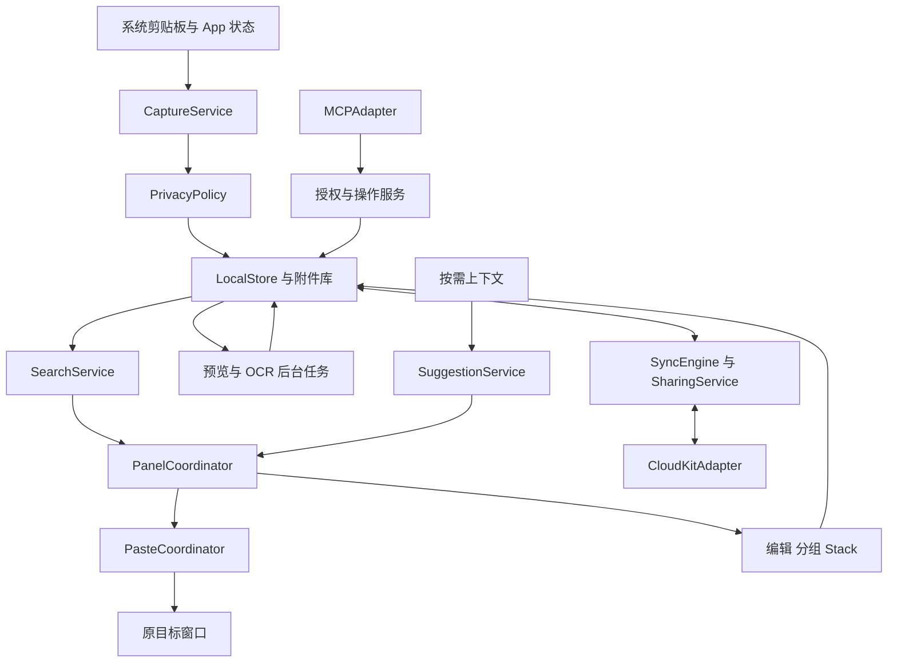
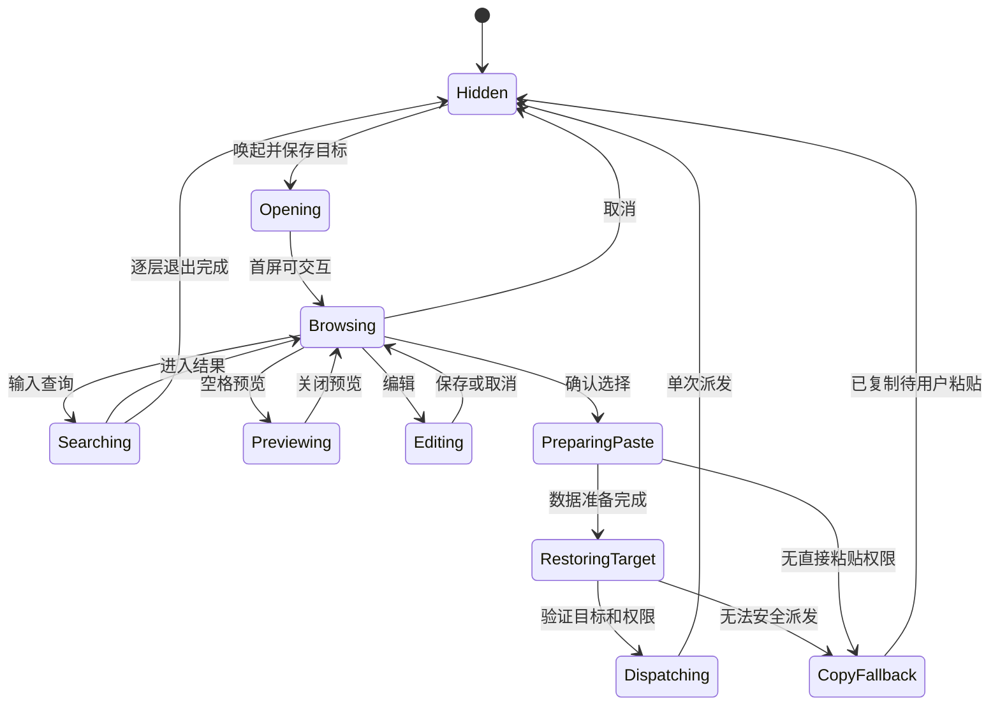

# ClipShelf 技术规格

版本：0.1 Draft · 日期：2026-10-09，Asia/Taipei

状态：待评审的实现规格；当前仓库只有初始化骨架，尚无可验收的应用。

配套文档：[产品动线](PRODUCT_FLOWS.zh-CN.md)

仓库：[Bestbbb/clipshelf](https://github.com/Bestbbb/clipshelf)

阅读导航：[功能范围](#coverage) · [模块与数据](#architecture) · [跨应用粘贴](#paste-contract) · [同步共享](#sync-sharing) · [验收与里程碑](#acceptance) · [待决问题](#open-questions)

## 1 产品目标与完整复刻的定义

ClipShelf 的目标是免费、开源地实现 Paste 的 macOS 用户功能和交互体验。最高优先级是：用户留在原来的工作上下文中，唤出剪贴板面板，找到内容，粘贴回原窗口的输入位置，然后继续工作。功能数量、界面截图和编译成功都不能替代这条流程的真实验收。

本规格沿用此前讨论的单平台方向，将 **macOS 完整功能对齐** 作为默认范围。单平台仍可以包含多台 Mac 同步。iPhone、iPad 应用及其键盘、分享扩展列在 F20，作为独立生态扩展；若范围扩为整个 Paste 产品体系，必须把 F20 加入发布验收，不能以本规格的 macOS 完成度代替全端完成度。

完整对齐包含采集、面板、搜索、粘贴、预览编辑、Pinboards、Paste Stack、隐私与保留策略，以及同步、共享、OCR、系统集成、智能建议和 MCP。先交付本地核心只是实施顺序，高级功能仍在最终目标中。

独立实现这些行为，采用 ClipShelf 的名称、代码、图标和视觉资产。完整复刻不包含 Paste 的付费墙、订阅验证或其私有服务接口；本项目的本地功能、源代码和正式安装包计划免费提供。

### 1.1 对标基线

- 功能基线：2026-10-09 可访问的 Paste 官方帮助、更新记录及官方 MCP 桥接仓库。
- 当前证据级别：公开文档与公开源码。尚未对安装版 Paste 录制操作、测量性能或完成视觉对比。
- M0 必须记录对标应用版本、构建号、安装渠道、macOS 版本、硬件、屏幕、输入法和授权状态，并固定一套可复跑夹具。
- 对标应用后续更新通过基线变更记录纳入，不让“完整”随网页变化而没有验收边界。
- 本规格中的模块划分、数据表、性能门槛和异常处理是 ClipShelf 的设计方案，不代表 Paste 的内部实现。

### 1.2 完成条件

F01 至 F19 每项都需要正常路径、异常路径、适用平台条件和验证证据。状态使用 `未实现 / 已实现待验证 / 已验证 / 条件受限 / 与基线有差异`。当前全部为未实现。与基线有差异的行为必须登记并评审；未完成项不能从覆盖率分母中移除。F20 是否进入分母由平台范围决定。

## 2 技术决策

| 决策 | 本版方案 | 原因与验证条件 |
| --- | --- | --- |
| 桌面技术 | Swift，AppKit 主面板，SwiftUI 设置及辅助界面 | 直接控制窗口、输入法、拖放、Quick Look 和焦点；M0 以真实 App 行为验证 |
| 主面板 | NSPanel 加可复用的 NSCollectionView 卡片 | 面板生命周期由 AppKit 控制，历史内容按需加载；非激活式配置需验证键盘与中文输入 |
| 系统底线 | 暂定 macOS 14 及以上 | 在 M0 确认最低版本和 SDK；智能建议另设系统与硬件条件 |
| 架构支持 | 目标 Apple silicon 与 Intel 的基本功能 | 只在实际硬件通过后声明支持；Apple Intelligence 能力单独标明 |
| 数据 | SQLite，候选 GRDB，附件独立文件 | 数据事务、迁移、索引和备份可独立测试；依赖版本在实施时锁定 |
| 搜索 | SQLite FTS5 加中文分词或 n-gram 索引 | 不能把默认按空格分词视为中文检索已经可用 |
| 图片文字 | Apple Vision，后台任务 | 本地 OCR；语言支持运行时查询，结果不会阻塞采集或粘贴 |
| 同步共享 | CloudKit 私有库与共享库适配器作为优先候选 | 匹配单平台和 Apple 账号动线；M3 前验证分发、容器权限、资产与 CKShare 行为 |
| 智能建议 | 单独的本地上下文与模型模块 | 按系统能力启用；模型不可用时普通历史、搜索和粘贴照常运行 |
| MCP | 本地 Streamable HTTP，附加 stdio 桥接 | 覆盖官方已公开连接方式；逐客户端授权与撤销 |
| 分发 | GitHub Releases 的签名、公证安装包；候选 Sparkle 更新 | 签名身份、更新验签和回滚应在正式发布前验证 |

现有 Tauri、React 和 Rust 文件是早期跨平台骨架。本次仅交付文档，不迁移或删除骨架，也不把它当作已获验证的技术选型。原生工程应在 M0 结论后建立。CloudKit 与自托管服务不在首轮同时实现；同步业务接口保留可替换性。

AppKit 的 [NSPanel](https://developer.apple.com/documentation/appkit/nspanel)、[SQLite FTS5](https://sqlite.org/fts5.html)、[GRDB](https://github.com/groue/GRDB.swift) 与 [Vision 文本识别](https://developer.apple.com/documentation/vision/recognizing-text-in-images) 是候选实现的直接依据，不能据此推断跨应用体验已经达标。

## 3 功能覆盖与阶段

阶段定义：M0 基线和技术验证；M1 核心跨应用操作；M2 本地完整工作流；M3 同步与系统高级能力；M4 全量兼容、性能及发布验收。下表是最低覆盖目录；每行包含的子行为都应展开为实现任务和测试。

| ID | 对齐能力 | 实现责任 | 首次交付 | 验收重点与来源 |
| --- | --- | --- | --- | --- |
| F01 | 文本、富文本、链接、图片、文件、颜色，多项复制及来源信息 | CaptureService、RepresentationCodec | M1，M2 补全格式 | 格式可还原；来源不确定时不伪造；[采集规则](https://pasteapp.io/help/what-paste-captures) |
| F02 | 底部面板、横向卡片、缩放与紧凑模式、多显示器、显示隐藏和焦点 | PanelCoordinator、TargetTracker | M1 | 原 App 输入上下文连续；[Mac 动线](https://pasteapp.io/help/paste-on-mac) |
| F03 | 即输即搜、跨历史及板检索、类型来源日期设备及多板筛选、定位原列表 | SearchService | M1，M2 补全 | 中文、筛选组合、过期查询取消；[搜索](https://pasteapp.io/help/search-and-filters) |
| F04 | 直接粘贴、复制回剪贴板、权限缺失降级 | PasteCoordinator | M1 | 无错目标或重复注入；[直接粘贴](https://pasteapp.io/help/paste-directly-to-other-applications) |
| F05 | 键盘导航、数字 Quick Paste、纯文本模式和修饰键配置 | CommandRouter、PastePlan | M1，M2 配置 | 搜索与结果键位区分；[快捷键](https://pasteapp.io/help/keyboard-shortcuts)、[纯文本](https://pasteapp.io/help/paste-as-plain-text) |
| F06 | 多选合并、拖出、拖入整理、图片作为文件、选择打开文件的 App | DragDropAdapter、PayloadAssembler | M2 | 顺序、格式、临时文件寿命；[图片文件更新](https://pasteapp.io/updates) |
| F07 | Quick Look、文本及文件预览、链接内置浏览 | PreviewService | M2 | 空格开关、不丢选择、无意外联网；[Mac 预览](https://pasteapp.io/help/paste-on-mac) |
| F08 | 新建文本、原位编辑、重命名、撤销、链接修改、旋转、颜色编辑 | ItemEditor、UndoCoordinator | M2 | 正文、表示格式和索引一致；[编辑](https://pasteapp.io/help/edit-items-before-pasting)、[更新](https://pasteapp.io/updates) |
| F09 | Pinboards 创建、颜色、改名、排序、固定、移板和删除 | PinboardService | M2 | 单条单板归属及删除范围；[Pinboards](https://pasteapp.io/help/organize-with-pinboards) |
| F10 | Paste Stack 按序收集、正反序消耗、移除、跨 App 连续粘贴 | StackCoordinator | M2 | 每次只消耗一项，取消不丢项；[Stack](https://pasteapp.io/help/using-paste-stack) |
| F11 | 隐私标记、排除 App、定时暂停、手动恢复、屏幕共享时隐藏 | PrivacyPolicy、PanelCoordinator | M1，M2 完整 | 过滤在入库前执行；共享隐藏逐系统与工具验证；[采集与忽略](https://pasteapp.io/help/what-paste-captures)、[共享显示选项](https://pasteapp.io/updates) |
| F12 | 历史期限、清空、固定条目保留、备份与恢复 | RetentionService、BackupService | M2 | 降低期限前计算影响；[保留](https://pasteapp.io/help/control-history-retention)、[迁移](https://pasteapp.io/help/where-paste-stores-your-data) |
| F13 | 首启、快捷键冲突、菜单栏、登录启动、设置、语言、退出和升级 | AppLifecycle、PermissionService | M1 至 M4 | 首次运行和升级后权限可恢复；[快捷键](https://pasteapp.io/help/keyboard-shortcuts) |
| F14 | 本地 OCR、图片文字检索、命中区域显示、提取文字 | OCRService、SearchService | M2 | 中英文夹具、失败可重试、低置信度不改原图；[搜索](https://pasteapp.io/help/search-and-filters) |
| F15 | 系统分享、Shortcuts 动作、iPhone 连续互通扫描导入 | SystemIntegration | M3 | 桌面入口、系统依赖和取消；[Shortcuts](https://pasteapp.io/blog/paste-with-shortcuts-for-macos-monterey)、[扫描更新](https://pasteapp.io/updates) |
| F16 | 多 Mac 历史和板同步、按设备开关、离线恢复 | SyncEngine | M3 | 幂等、删改冲突、附件完成状态；[iCloud](https://pasteapp.io/help/icloud-sync-doesn-t-work) |
| F17 | Shared Pinboards 邀请、只读或编辑、退出、撤权、停止共享 | SharingService | M3 | 权限由远端执行，离线边界明确；[共享板](https://pasteapp.io/help/shared-pinboards) |
| F18 | Intelligent Clipboard 建议和独立的系统 Writing Tools | SuggestionService、WritingToolsAdapter | M3 | 能力与权限门禁、上下文释放；[智能建议](https://pasteapp.io/help/intelligent-clipboard)、[编辑](https://pasteapp.io/help/edit-items-before-pasting) |
| F19 | MCP 连接、检索读写、板管理、逐客户端授权撤销 | MCPAdapter | M3 | 11 个工具和权限矩阵；[Paste MCP](https://pasteapp.io/help/paste-mcp)、[官方 manifest](https://github.com/pasteapp/paste-mcp/blob/main/manifest.json) |
| F20 | iPhone、iPad、移动键盘、分享扩展、小组件 | 独立移动端工程 | 平台扩展 | 默认不计入 macOS 完成分母；[移动端](https://pasteapp.io/help/paste-on-iphone) |

产品入口对应：[采集](PRODUCT_FLOWS.zh-CN.md#u02)、[唤起与粘贴](PRODUCT_FLOWS.zh-CN.md#u03)、[搜索与键盘](PRODUCT_FLOWS.zh-CN.md#u04)、[预览编辑](PRODUCT_FLOWS.zh-CN.md#u06)、[板](PRODUCT_FLOWS.zh-CN.md#u07)、[多选拖放](PRODUCT_FLOWS.zh-CN.md#u08)、[Stack](PRODUCT_FLOWS.zh-CN.md#u09)、[隐私](PRODUCT_FLOWS.zh-CN.md#u10)、[保留备份](PRODUCT_FLOWS.zh-CN.md#u11)、[同步共享](PRODUCT_FLOWS.zh-CN.md#u12)、[系统集成](PRODUCT_FLOWS.zh-CN.md#u13)、[智能建议](PRODUCT_FLOWS.zh-CN.md#intelligence)、[MCP](PRODUCT_FLOWS.zh-CN.md#mcp)、[首启](PRODUCT_FLOWS.zh-CN.md#u01)、[生命周期](PRODUCT_FLOWS.zh-CN.md#u14)。

## 4 模块边界

窗口和系统输入调用在 MainActor；数据库使用串行写入与一致性读事务；OCR、图片解码、索引和网络走可取消的后台任务。面板呈现不等待 OCR、同步、智能建议或大图解码。所有入口复用同一套数据操作与权限规则，MCP、Shortcuts 不能绕过隐私和共享板权限直接写数据库。

| 模块 | 输入 | 输出与边界 |
| --- | --- | --- |
| CaptureService | 剪贴板变化计数、表示格式、来源线索 | 一致的 CaptureSnapshot 或结构化跳过原因 |
| PrivacyPolicy | App 标识、系统标记、暂停状态、用户规则 | allow 或 deny；不把敏感正文送入日志或模型 |
| LocalStore | 已通过过滤的快照、编辑和删除命令 | 事务化条目、附件引用、变更版本及待同步操作 |
| PanelCoordinator | 用户命令、查询结果、TargetContext、共享显示偏好 | 选择、预览、退出、PasteIntent；统一窗口捕获保护策略，不直接注入键盘 |
| PasteCoordinator | 明确选择、输出模式、原目标上下文 | copied、dispatched、cancelled、failed；不把 dispatched 等同实际插入 |
| SearchService | 文本、结构化筛选、分页游标、请求版本 | 稳定有序的结果及匹配字段 |
| SyncEngine | 本地 outbox、远端增量、设备状态 | 可重试同步，不向系统剪贴板写入远端内容 |
| SuggestionService | 用户启用时的短生命周期上下文 | 建议条目 ID，不修改正文、不自动粘贴 |
| MCPAdapter | 已授权客户端的类型化请求 | 范围内数据与操作结果，不接收任意脚本或系统命令 |

## 5 数据与持久化

### 5.1 逻辑模型

一次复制可能包含多个文件或对象，每个对象又有多种表示格式。必须保留这两层顺序，不能把全部复制内容压成一个字符串或一张 PNG。

| 实体 | 关键字段 | 不变量 |
| --- | --- | --- |
| ClipItem | UUID、创建时间、最近采集时间、origin、类型、标题、来源及可信度、revision、deletedAt | ID 不随标题、编辑或同步变化 |
| ClipPart | itemID、ordinal | 表示一次复制中的第几个对象 |
| Representation | partID、UTType、blobID、字节数、完整性状态 | 同一对象保留纯文本、RTF、HTML、图像等可用原始表示 |
| Blob | UUID、相对路径、本地校验和、大小、引用数 | 原子落盘；禁止由剪贴板内容指定任意写入路径 |
| HistoryEntry | itemID、排序时间、可见状态 | 历史可见性与是否钉选分别管理 |
| Pinboard | UUID、名称、颜色、排序值、共享标识、版本 | 一个条目在同一时刻最多归属一个板 |
| PinMembership | itemID UNIQUE、boardID、排序值、版本 | 移板是移动归属；历史仍可引用同一条目 |
| DerivedContent | itemID、sourceRevision、预览、OCR 文本及坐标、索引状态 | 旧版本计算结果不能覆盖新版本 |
| StackSession | 会话 ID、方向、状态、待消耗条目顺序 | 临时队列；重启恢复策略需与 M0 基线对照 |
| OutboxOperation | UUID、entityID、baseRevision、操作、重试信息 | 本地业务写入和入队同事务提交 |
| SyncState | 设备 ID、账号命名空间、增量令牌、共享库状态 | 不跨 Apple 账号复用令牌或队列 |
| Tombstone | entityID、删除版本、同步确认状态 | 离线旧数据不能复活已删除对象 |

字符串保存 Unicode 原文；检索归一化另存索引。不能为了搜索改写正文、代码缩进、换行或颜色文本。原始 RTF/HTML 与编辑后的表示要按 revision 更新，不能出现预览显示新内容而粘贴旧内容。

来源优先读取可验证的剪贴板来源标记，再使用采集时前台 App 作为线索；标记、前台 App 都不构成安全身份。Universal Clipboard、后台应用或桥接程序的来源可能未知，界面应允许显示“来源未知”。

### 5.2 文件和附件

文件条目保留 URL、必要的持久访问凭据及显示元信息。文件引用与完整文件副本分开：原文件移走或失去权限时不能宣称可恢复；同步一个路径不等于同步文件。M0 需确认 Paste 对文件持久化与多 Mac 文件可用性的实际行为。

图片原件、缩略图和导出的临时文件分开存储。图片作为文件拖放时使用受控导出目录或系统 file promise，在接收应用完成读取前保留文件；生命周期根据回调和超时清理，不能在拖放结束瞬间无条件删除。

写入采用“临时附件写完并校验 → 原子重命名 → 数据库提交引用”。崩溃产生的孤立附件由启动清理回收。删除先移除对象引用，等待撤销窗口与同步约束满足后回收；缓存和 OCR 索引一并失效。

### 5.3 索引与迁移

FTS 索引覆盖正文、用户标题、链接元数据和 OCR；来源、类型、日期、设备、板使用结构化列。中文短词、中英混合、网址片段、emoji 和代码标识符需要独立夹具，M0 决定分词器与子串兜底。所有查询参数化，输入不得被直接拼接为 FTS 语法。

数据库 schema 递增版本。迁移前生成一致性备份，失败时保留原库、停止新版本写入并提供恢复。备份采用 [SQLite backup API](https://sqlite.org/backup.html) 或一致性快照，附带附件清单、schema 版本与校验和。直接复制正在写入的数据库不作为备份方案。

## 6 采集与隐私处理

`NSPasteboard.changeCount` 用来识别所有权变化，[Apple 文档](https://developer.apple.com/documentation/appkit/nspasteboard/changecount)没有提供完整历史事件队列保证。初始方案轮询变化计数，仅变化时读取实际内容；轮询间隔在 M0 平衡捕获延迟与能耗。短于采样窗口的连续覆盖可能丢失，必须测量，不能承诺无限速零漏采。

处理次序：

1. 检查用户是否启用采集、是否暂停、会话是否锁定，以及来源排除规则。
2. 检查 confidential、concealed、transient 等已知类型标记；命中即结束，不生成预览、OCR、索引或上传。
3. 读取 `changeCount` 与条目类型，提取允许的对象和表示，再次核对计数。过程中变化则丢弃该次不一致快照并读取新状态。
4. 识别本程序回写事务，避免“粘贴回写 → 再采集”的循环。事务 ID、计数与本地摘要联合判断；不能永远忽略全部同内容复制。
5. 按一致快照计算本地去重标识，写入内容、历史关联及 outbox，然后更新 UI。
6. 在后台生成缩略图、OCR 和检索派生数据。结果必须匹配源 revision。

默认保留原始格式，纯文本选项只影响输出计划。[Paste 采集规则](https://pasteapp.io/help/what-paste-captures)中的颜色识别应单独测试：六位十六进制、前缀或字母要求，纯数字、短码和混合文本的差别。不能把任意六位验证码当颜色。

相邻重复采集初步采用合并并更新时间；用户新复制、编辑后版本、来源变化和板归属的处理需要 M0 对照测试。重名、同文本的独立编辑条目不能被盲目合并。

暂停期间推进观察基线，恢复时不补录暂停期间留下的剪贴板内容；首次启动先建立基线，避免意外导入启动前内容。这两项是 ClipShelf 的隐私方案，记录到差异表并核对 Paste 实际行为。不能保证识别未带标记的全部密码，设置中必须能排除应用并解释检测边界。

## 7 面板与跨应用粘贴

### 7.1 状态和目标上下文

每次唤起保存 `TargetContext`：进程身份、应用标识、可获得的原窗口和聚焦控件引用、显示器、唤起时间及上下文代次。只保存定位所需信息，不读取或记录目标输入框正文。搜索、Quick Look、设置和权限窗口都不得覆盖最初目标。

面板以当前工作显示器的可见区域定位，考虑 Dock、菜单栏、不同缩放、屏幕拔插及全屏空间。显示器选择规则、面板高度范围、紧凑模式阈值和动画曲线以 M0 测量确定，不能用猜测的像素值标作 Paste 一致。

对齐 Paste 的“Show during screen sharing”设置，PanelCoordinator 统一管理主面板、Quick Look、编辑与 Stack 等含内容窗口的捕获保护。M0 分别记录默认值、应用范围，以及整屏共享、单窗口共享和录屏结果；使用公开系统能力实现，无法可靠隐藏的组合明确标为受限。不能把某一窗口配置等同于所有 macOS 版本、会议工具或截图方式都不可捕获。这是内容展示控制，与智能建议申请的屏幕读取权限分别管理。[官方更新记录](https://pasteapp.io/updates)

输入焦点必须区分搜索、结果、编辑器和输入法候选。中文组合输入期间的 Return、Space、方向键先交给输入法；选词不能触发粘贴、Quick Look 或移动卡片。非激活 NSPanel 是否能完整支持这些状态由原型验证。

### 7.2 粘贴事务

`PasteIntent` 包含选择的条目及其 revision、有序选择、输出模式、目标上下文代次和唯一 attemptID。输出模式至少有保留格式、纯文本、图片作为文件、复制到剪贴板。

1. 冻结当前选择，防止历史新增或搜索结果刷新改变此次输出对象。
2. 加载并校验所需表示，完成所有转换后才替换系统剪贴板；失败时保留用户原剪贴板。
3. 校验目标仍存在、会话未锁定、权限有效，检查用户是否已主动转到另一应用。
4. 写入原始多格式内容及内部回写标记。纯文本只输出文本表示，不改历史原件。
5. 收起面板，尝试恢复原应用及窗口，等待实际激活状态；[activate](https://developer.apple.com/documentation/appkit/nsrunningapplication/activate(options:)) 返回成功也不等于插入成功。
6. 核对目标前台身份和可用焦点，等待用户修饰键释放，再派发一次 Cmd-V。不向错误前台发送，不额外发送 Return。
7. 返回派发状态。目标退出、焦点改变或无法验证时转为“已复制，请在目标应用粘贴”；禁止自动重试造成重复插入。

Paste 官方说明直接粘贴使用辅助功能权限并向前台发送 Cmd-V；无权限时退回剪贴板复制。[官方说明](https://pasteapp.io/help/paste-directly-to-other-applications) 同样构成本项目的降级验收参考。

普通第三方应用没有统一的“内容已插入”回执。`dispatched` 仅表示命令已派发；只有受控测试目标或用户观察能证明插入位置和内容正确。不能依赖固定 sleep 后无条件发送按键，也不能把 AX 权限存在视为一切应用均可写入。

### 7.3 键盘与多项行为

全局快捷键只负责唤起面板及 Stack；面板命令按当前焦点路由，避免截获其他 App 的普通输入。全局注册机制在 M0 验证冲突、系统占用、Secure Input 和权限需求，不能假设能绕过系统限制。

完整键位与鼠标动线见产品文档。重要不变量：搜索框第一次 Return 进入结果，结果上的 Return 执行粘贴；Cmd-1 至 Cmd-9 对应当前可见列表；纯文本修饰键可配置；重复 keyDown 不重复派发；Escape 按当前交互层级退回。

多选保持稳定输出顺序。文本分隔、混合文本图片、多文件、RTF 合并规则必须用 Paste 基线决定；在规则未验证前，不可把“已经写入多个 NSPasteboardItem”视为任意目标都能接受。不同目标不支持的组合要有明确降级和逐项工作流。

Stack 用独立临时队列收集与消耗；每次采集有独立队列出现次数，即使复用同一历史条目也不被历史去重吞掉。每次用户粘贴只推进一个队列位置；内部回写不重入；已知失败或取消不能消耗。缺少插入回执时不做自动重发，提供可恢复上一项的操作；队列推进点、重启保留及默认方向在 M0 验证。

## 8 搜索 预览 编辑和整理

### 8.1 搜索与排序

查询状态包括文本、类型、来源应用、日期范围、设备和 `pinboardIDs` 集合。搜索默认跨历史与 Pinboards，不能把当前板误当作唯一搜索范围；显式选择单板或多板后才应用板条件。各维度及多板之间的组合关系由 M0 冻结，验收覆盖单板、多板、清除条件和空结果。单选结果支持 Cmd-G 定位回所在历史或板。结果使用稳定 itemID 选中；后台新增条目不能让 Quick Paste 数字在一次按键事务中漂移。

每次查询分配 generation，新查询取消旧工作，返回时核对 generation。首次加载分页展示元数据和缩略图；大文件、原图、完整富文本在预览或输出时按需读取。无匹配、索引尚在更新、同步附件未就绪须分别呈现。

OCR 是可延迟的派生结果。保存识别语言、引擎版本、源 revision、置信度及原图归一化坐标。旋转图片后重新计算坐标和文字；不会拿旧坐标高亮新图。搜索夹具含简体、繁体、英文、中英混排和低清图片，低置信度结果不能静默替换正文。

### 8.2 预览与原位编辑

Quick Look 或应用内预览按内容类型选用，关闭后恢复原卡片选择和横向位置。文件失效时显示可定位原件的动作；不把预览缓存当作可粘贴原件。

链接元数据与内置网页预览会产生网络访问，必须独立于普通剪贴板采集。默认先显示本地 URL，首次联网预览说明行为；这是待评审的隐私差异。WKWebView 使用隔离的数据容器，不暴露数据库或应用命令桥，不自动打开自定义协议或下载附件。HTML/RTF 预览不执行脚本，不自动加载远端图片。

文本编辑保持已有格式，改名只改用户标题。图片旋转和颜色修改产生新 revision 并更新相应输出表示。撤销在已定义的操作边界内工作，不能把系统目标应用的 Cmd-Z 当成本应用的撤销。全局“始终纯文本粘贴”不丢弃已保存的富文本。

### 8.3 Pinboards 与历史

按[官方规则](https://pasteapp.io/help/organize-with-pinboards)，单条记录最多属于一个板；固定后仍可出现在历史中；板和板内条目可以排序。移动归属、取消固定、移出历史和彻底删除是不同数据操作。

删除板会影响其内容，产品确认必须展示条目数量与共享影响。是否同时删除历史中的对应项、批量删除和撤销的具体边界，列入 M0 基准；在结论确定前不实现静默级联删除。更新板顺序或条目顺序时使用稳定的排序字段和原子批次，拖动中不因为后台同步跳位。

## 9 权限和系统集成

| 能力 | 申请时机 | 拒绝或失效后的行为 |
| --- | --- | --- |
| 普通采集 | 首启明确说明并由用户开始记录；读取策略按目标 macOS 验证 | 暂停并显示可理解的状态，不循环弹窗 |
| 辅助功能 | 用户启用直接粘贴或相关 Stack 能力时 | 保留历史和搜索，选择后复制回剪贴板 |
| 登录启动 | 用户开启该设置时 | 显示系统管理状态，关闭时不自动重新注册 |
| 文件访问 | 用户选择文件、目录、备份或重新定位原件时 | 保留元数据，禁用不可用的文件操作 |
| 屏幕录制或系统等效权限 | 用户单独启用智能建议并首次使用时 | 普通面板照常；建议页解释缺少的能力 |
| iCloud | 用户主动开启同步或接受共享时 | 离线本地可用，显示账号或容量问题 |
| MCP 客户端 | 用户明确连接并确认访问范围时 | 未授权请求拒绝，撤销后停止后续访问 |

用 `AXIsProcessTrustedWithOptions` 检查辅助功能状态，前台返回和派发前重新校验。授权引导不能把所有能力捆绑成首启必选项。签名、安装路径和应用更新可能影响授权识别，正式包必须覆盖升级恢复测试。

Shortcuts 接口先抽象为“添加文本或链接到板”“取最近匹配项”“按索引获取条目”，再对照安装版现行动作名、参数、输出和错误行为。历史官方博客只能证明曾提供相应功能，不能替代现版本参数验收。[Shortcuts 参考](https://pasteapp.io/blog/paste-with-shortcuts-for-macos-monterey)

扫描导入使用系统提供的连续互通入口，将返回的图像或文档走统一导入、OCR 和存储服务。iPhone 未连接、用户取消、扫描失败和多页结果必须分别处理；Mac 的系统扫描入口不等同实现了 F20 移动 App。

## 10 同步与共享

### 10.1 选择与边界

同步默认关闭，开关按设备保存。开启前展示上传对象范围和已有历史是否加入。只把远端变化加入历史与板，不覆盖本机当前剪贴板，不产生二次采集循环。

候选实现是 CloudKitAdapter：私有历史放用户私有库，共享板通过 CKShare 或合适的独立共享 zone 管理。共享对象与私有历史隔离，不因分享某个板而上传其他历史。CloudKit 官方说明共享基于记录层级或 zone，且同一记录不能同时加入多个 share；适配层必须为移入、移出共享板设计明确的数据迁移。[CKShare](https://developer.apple.com/documentation/cloudkit/ckshare)

CloudKit 的分发 entitlement、开发与生产容器、账户状态、配额及共享限制是 M3 进入条件。第三方自行构建的应用能否使用同一云容器需要单独验证；本地功能应始终可独立构建。自托管同步是将来的适配器选项，不在本轮附带实现承诺。

### 10.2 同步协议契约

- 业务层使用稳定 UUID、操作 ID、baseRevision、来源设备和明确删除事件。
- 本地内容写入与 outbox 同事务，重试不重复产生对象；远端成功但确认丢失也应幂等恢复。
- CloudKit 适配器保存增量令牌与 record change tag，不能把另一种服务的“全局整数游标”硬套给 CloudKit。
- 附件先完成上传，再让对应 revision 进入远端可用状态；另一端区分“已知条目”与“附件可下载”。
- 冲突读取远端版本后按规则合并。元数据允许确定性字段合并；正文并发编辑保留冲突副本，不静默丢弃一方。
- 删除优先阻止旧 revision 复活。墓碑清理需有设备离线有效期或快照代次；过期设备先重建状态，再处理本地新操作。
- 账号退出或切换时隔离原账号队列和数据，不把工作账号历史上传到新账号。是否保留本地副本需让用户明确选择。
- 关闭同步初步只停止传输，清理云数据单独执行。Paste 当前帮助对共享板与同步开关的描述有冲突，这一语义必须实测并登记差异。

### 10.3 共享与隐私

共享至少包括所有者、可编辑成员、只读成员，以及邀请、接受、离开、移除和停止共享。远端访问权限和客户端业务校验共同约束操作，客户端禁用按钮不能替代远端授权。邀请范围、链接有效性和可见内容需要在确认前展示。[Paste 共享板](https://pasteapp.io/help/shared-pinboards)

以下是 ClipShelf 角色契约草案。公开帮助确认只读与可修改两类参与权限，但未逐项明确管理动作；标为“待定”的项目需 M0 对照，M3 验证后端是否能强制执行。若 CloudKit 的记录权限粒度无法表达约束，应调整数据边界或同步适配器，不能只在界面隐藏入口。

| 操作 | 所有者 | 可编辑成员 | 只读成员 |
| --- | --- | --- | --- |
| 查看、搜索、复制、粘贴 | 允许 | 允许 | 允许 |
| 新增、修改条目正文 | 允许 | 允许 | 拒绝 |
| 删除共享条目 | 允许 | 待定 | 拒绝 |
| 修改共享排序 | 允许 | 待定 | 拒绝；本地视图偏好不算共享写入 |
| 改板名、颜色及元数据 | 允许 | 待定 | 拒绝 |
| 发起邀请、改变成员权限、移除成员 | 允许 | 待定，冻结前不授予 | 拒绝 |
| 停止整个板的共享、删除共享板 | 允许 | 拒绝 | 拒绝 |
| 离开共享板 | 使用停止共享路径 | 允许 | 允许 |

转发已有邀请链接不等于拥有新增授权或管理成员的权限；按“指定参与者”或“持链接者”访问范围验证实际可加入对象。

离线设备可能仍有已下载的数据；撤权不能收回对方已复制的内容。重新联网后拒绝未授权写入并更新本地可见性，冲突草稿不应自动发布。连接断开期间不宣称已完成即时撤权。

传输和云端保护按实际 CloudKit 配置核验，不能从“私有 iCloud”直接推导“只有用户能解密”。如果项目承诺额外的应用层端到端加密，M3 必须先补齐独立设计与测试：设备密钥分发、恢复、共享板密钥、轮换、成员退出、密钥丢失及云备份。此前讨论的端到端加密是候选方案，当前没有已实现的加密能力。

## 11 智能能力与 MCP

### 11.1 智能建议与 Writing Tools

官方帮助把 Intelligent Clipboard 列为 macOS 26 及以上、Apple Intelligence 可用时的能力，并描述首次 Suggestions 使用时的屏幕权限要求。它和编辑器中的 Writing Tools 是两个独立入口。[智能建议](https://pasteapp.io/help/intelligent-clipboard)、[Writing Tools](https://pasteapp.io/help/edit-items-before-pasting)

ClipShelf 的实现契约：用户开启建议后，只有面板打开且目标 App 未被排除时才获取必要上下文；只取当前会话所需范围；关闭面板就释放截图和提取的临时文本。密码控件、排除应用和上下文识别失败时不生成建议。普通搜索不依赖这一权限。

建议只返回本地历史条目 ID，不改变剪贴板或代替用户确认。历史正文、网页和截图是数据，不作为系统指令执行。模型未准备好、语言不支持、超时或无结果时显示对应状态并保留原时间线。模型提供者与上下文获取方式要用公开 API 做 M0/M3 技术验证，不假设能调用 Paste 的模型或复现其私有排序算法。

Writing Tools 使用系统支持的文本控件和能力检测，处理接受、取消、撤销及格式保留。准确性需要固定任务集和人工判断，不能只统计“模型调用成功”。

### 11.2 MCP 连接和工具

Paste 的官方桥接源码提供本地 Streamable HTTP、Bearer 与会话标识、OAuth PKCE 授权及 stdio 桥接；自定义客户端也可使用服务地址和令牌。接口细节依据固定的官方仓库 commit 和实机 `tools/list` 在 M0/M3 冻结。[连接帮助](https://pasteapp.io/help/paste-mcp)、[自定义客户端](https://pasteapp.io/help/connect-custom-mcp)、[官方传输实现](https://github.com/pasteapp/paste-mcp/blob/main/src/transport.ts)

必须覆盖的公开工具名：

| 类别 | 工具 |
| --- | --- |
| 查询 | `search`、`read_item`、`list_pinboards` |
| 条目 | `create_item`、`update_item`、`delete_item` |
| 板管理 | `create_pinboard`、`rename_pinboard`、`delete_pinboard` |
| 板归属 | `add_item_to_pinboard`、`remove_item_from_pinboard` |

这是[官方 manifest](https://github.com/pasteapp/paste-mcp/blob/main/manifest.json)中的能力名单；参数、分页、批量行为、附件与错误结构未完成实机核对，不能自行编造后声称协议兼容。ClipShelf 的 schema 应有版本号、分页上限、结构化错误和契约测试。

候选本地服务仅绑定 loopback，使用独立可配置端口，校验 Host、Origin、令牌和会话；不占用 Paste 的端口。凭据存 Keychain，连接与撤销在应用中可见，撤销影响已有会话的后续请求。OAuth 回调绑定一次性 state 与 PKCE，不把令牌放进日志或公共 URL。

访问范围方案区分读、写、删除以及允许访问的列表；具体授权界面与基线对照。每个请求在操作层重新检查授权和共享板权限；客户端不得直接获得数据库文件。MCP 不提供无确认的系统键盘注入接口。被授权 AI 客户端可能把读取的数据传到其模型服务，连接界面必须说明这条数据流。

## 12 保留 备份和生命周期

保留期限按[官方当前选项](https://pasteapp.io/help/control-history-retention)对齐：一天、一周、一月、一年、永久，默认一月；钉选内容保留。缩短期限前计算受影响条目并确认，批量清空历史保留 Pinboards。历史可见性变化与条目实体回收分开执行。

容量控制是 ClipShelf 的额外保护方案：展示本地占用，附件过大或磁盘不足时给出可理解的状态；不悄悄覆盖固定内容。具体单项大小和缓存配额在 M0 真实负载测试后确定，不以收费解锁扩大容量。

导出备份包含 schema、清单、正文、原始表示和板关系，恢复时先验证版本、大小、路径、校验和与可用空间，再生成备份并事务化导入。备份可含敏感内容，提供可选择的加密导出；默认导出形式待评审。跨版本回滚必须兼容数据迁移，不能只替换应用二进制。

关闭主面板继续后台采集；明确退出则注销快捷键、终止监听、完成数据库提交并取消后台任务。登录启动只按用户设置注册。睡眠或锁屏时不获取智能上下文，唤醒后重新校验屏幕、权限、账号与观察基线。

正式发行固定 bundle ID，区分 debug 数据目录、开发云容器和用户生产数据。自动更新使用签名验证，发布管线不得把剪贴板样本、凭据或用户数据库打入安装包。[Sparkle 分发与验签文档](https://sparkle-project.org/documentation/)

## 13 性能与兼容验收

以下是建议验收门槛，均未实测，不是 Paste 的性能数据。M0 先记录同机同场景 Paste 基线，再评审绝对门槛与相对差距。只测 release 构建，debug 结果不用于对外性能结论。

| 指标 | 建议门槛 | 测量边界 |
| --- | --- | --- |
| 温热唤起 | p95 不高于 120 ms | 全局快捷键回调到首屏可选择；另报完整动画结束时间 |
| 历史检索 | 10,000 条夹具下 p95 不高于 100 ms | 已提交字符到结果稳定；中文组合输入单独测 |
| 直接粘贴 | p95 不高于 250 ms | 用户确认到目标出现内容；只在可观测夹具上计时 |
| 正确性 | 每场景 30 次，至少 29 次完成预期操作 | 任何错目标、重复插入或额外发送动作均阻止该场景通过 |
| 焦点与取消 | 所有必测取消路径返回正确状态 | Escape、点外部、Cmd-Tab、目标退出、系统权限窗口 |
| 长时间运行 | 8 小时采集与空闲混合测试无持续内存增长 | 同时记录 CPU、唤醒次数、附件缓存和数据库大小 |
| 历史规模 | 10,000 条混合日常夹具与 100,000 条压力夹具 | 对压力规模报告退化，不把常规门槛外推 |

硬件信息必须随结果提交。性能比较使用相同数据、显示器、操作和电源状态，不把自动化调度耗时误记成界面延迟。采集延迟单列，包含采样周期，不能与唤起延迟混算。

### 13.1 真实应用矩阵

| 场景 | 内容与断言 |
| --- | --- |
| Safari 或 Chrome → TextEdit 或 Word | 多段富文本；样式保留与纯文本两种输出；原光标位置 |
| 微信或飞书 → 备忘录 | PNG、透明图、大图；实际插入可查看，不仅剪贴板有数据 |
| VS Code → VS Code 或其他编辑器 | 中英代码、缩进、换行、多个窗口、选区替换 |
| Finder → Finder 或支持附件的应用 | 单文件、多文件、失效路径、图片作为文件 |
| 表格或浏览器表单 | Stack 顺序、反序、移动到下一输入框、取消后继续 |
| Terminal 或 iTerm | 只触发粘贴、不额外发送 Return；使用无副作用测试字符串 |
| 全屏和多显示器 | 不强制切错 Space；面板位置、缩放、拔插、焦点恢复 |
| 屏幕共享和录屏 | 在各支持系统及会议工具中逐一验证显示开关；记录主面板、预览、Stack 是否进入接收画面及已知限制 |
| 输入法和辅助功能 | 简繁中文候选、VoiceOver、减少动态效果、提高对比度 |

未安装或不可用的目标标记“未测”，不能计为通过。必须区分应用版本、网页编辑器与原生编辑器；不能从一个 Chrome 文本框推断全部 Web 应用兼容。

### 13.2 分层测试

- 单元和属性测试：多格式编解码、去重、筛选、单板归属、撤销、清理、outbox、墓碑、版本迁移。
- 数据集成测试：附件半写入、磁盘满、损坏备份、迁移失败、并发编辑、删改冲突、账号切换。
- UI 测试：键盘路由、IME、选择稳定性、对话框、空态、错误态、拖放和紧凑模式。
- 原生端到端测试：受控目标应用记录输入结果，加上真实 App 人工验收；注入已派发不算插入通过。
- 同步测试：两台 Mac 断网重连、重试、删除不复活、只读拒写、离线撤权、附件未完成。
- MCP 测试：工具 schema、过期或撤销会话、访问范围、共享权限、并发写入、结果分页。
- 发布测试：全新账号安装、签名公证、升级保留历史、权限恢复、登录启动、退出后无残留监听。

每项证据包含功能 ID、用例、前置条件、步骤、预期、实际、环境、构建 commit 和必要的脱敏截图或录像。测试仅使用合成内容，不采集参与者私人剪贴板。

## 14 实施里程碑

| 阶段 | 交付物 | 出口条件 |
| --- | --- | --- |
| M0 | Paste 版本化行为基线、原生窗口与粘贴实验、权限和分发验证、数据格式样本 | 解决焦点、IME、全屏、多显示器关键可行性；形成 ADR 与差异清单 |
| M1 | 采集、本地存储、底部面板、搜索、复制降级、直接粘贴、基本隐私设置 | 三类核心跨 App 用例通过，重启恢复，目标错误为零；标为核心预览版 |
| M2 | 富格式与文件、预览编辑、Pinboards、Stack、OCR、保留备份、完整输入操作 | 本地流程和数据异常矩阵通过；仍不宣称已完整对齐 Paste |
| M3 | CloudKit 同步共享、Shortcuts/扫描、智能能力、完整 MCP 授权工具 | 各模块独立验收，能力受限状态清楚，离线及权限测试通过 |
| M4 | 性能、兼容、视觉与动效对比、可访问性、安装升级与文档 | F01 至 F19 全部逐项验收；所有剩余差异明确登记并评审 |

以同一基线逐项关闭差距，不能通过把功能改为“以后再做”来宣布完整对齐。每个里程碑提供可运行安装包和对应代码版本；文档阶段不产生虚构的安装包、测试结果或开发时长。

## 15 待决问题与风险

| 编号 | 决策或未知项 | 解决方式与最迟阶段 |
| --- | --- | --- |
| Q01 | 平台范围是否扩到 iPhone 和 iPad | 默认 macOS；范围评审决定 F20 是否成为主目标 |
| Q02 | 最低 macOS、Intel 支持范围与原生面板配置 | M0 在目标系统测焦点、IME、全屏、快捷键及屏幕共享隐藏 |
| Q03 | 去重、重复唤起、板删除、Esc 层级、Stack 消耗与重启语义 | M0 用同一批合成数据对照 Paste 录制 |
| Q04 | 文件保存的是引用还是可移植副本，混合多选怎样输出 | M0 文件移动、源文件删除及跨 Mac 测试 |
| Q05 | 同步关闭与共享板删除的官方描述冲突 | M0 对照当前安装版，M3 前确定兼容或明确差异 |
| Q06 | CloudKit 正式分发、共享粒度、配额与自编译配置 | M0 验证身份路径，M3 前以生产配置小规模演练 |
| Q07 | 是否承诺额外应用层端到端加密 | M3 前完成密钥生命周期和共享协议设计；未通过不得宣传 |
| Q08 | 智能建议公开 API、系统与语言可用性 | M0 可行性验证，M3 完整质量与权限测试 |
| Q09 | 当前 Shortcuts 动作与 MCP 实际 schema | M0 记录公开版本，M3 契约测试冻结 |
| Q10 | 签名、公证、更新基础设施和维护资源 | M4 之前落实；无签名测试包与正式发布明确区分 |

### 15.1 明确差异提案

D01 至 D04 是待评审提案，对齐基线后决定采用、修改或取消；D05 是已经确认的项目定位。

| 编号 | 提案 | 对完整复刻的影响 |
| --- | --- | --- |
| D01 | 初启不追溯采集启动前内容，恢复记录不补采暂停期内容 | 对照 Paste 后确认提示及默认行为 |
| D02 | 链接预览首次联网需说明，默认先显示本地信息 | 可能增加一次首次操作，需要评审体验与隐私取舍 |
| D03 | 同步关闭只停止传输，删除云数据单列 | 涉及共享板官方文档歧义，不能先实现再认作一致 |
| D04 | 提供显式、可加密的可移植备份包 | 补充 ClipShelf 的备份入口，不宣称 Paste 原有相同接口 |
| D05 | 免费开源、无订阅或功能解锁 | 已确认的项目定位差异 |

## 16 开源与过程记录

技术实施保持可审查的模块和阶段提交。每个里程碑保存需求变化、架构决策、可复现失败、测试夹具及修复理由，作为未来实战材料的基础。模型成本与开发时间只记录实际可追溯数据，不补写看似精确的数字。

公开仓库只包含合成样例、脱敏证据和代码。私人剪贴板、个人应用截图、密钥、签名证书、访问令牌及用户数据库不进入提交。面向学习者的材料复用正式验收标准，避免演示版能跑而实际跨应用流程不可用。

## 17 评审顺序

首先评审平台范围和完整功能矩阵，其次确认技术选型与跨应用粘贴不变量，再确认产品文档中的正常与异常动线。随后处理 Q01 至 Q10 和 D01 至 D05。评审结论进入版本记录，M0 才据此开展应用实验与实现。

版本记录：2026-10-09，0.1 Draft，建立完整功能范围、原生架构方案、数据与状态契约、阶段计划及验收门槛。当前尚未开始按本规格实现。
